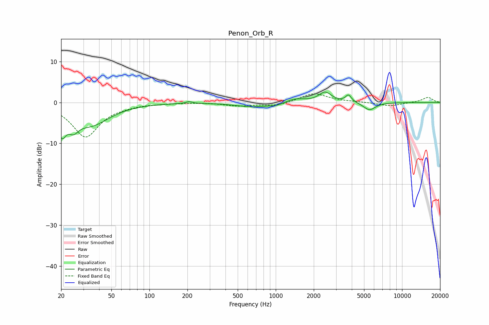

# Penon_Orb_R
See [usage instructions](https://github.com/jaakkopasanen/AutoEq#usage) for more options and info.

### Parametric EQs
Apply preamp of -2.6 dB when using parametric equalizer.

|   # | Type    |   Fc (Hz) |    Q |   Gain (dB) |
|-----|---------|-----------|------|-------------|
|   1 | Peaking |        20 | 4.22 |        -5.5 |
|   2 | Peaking |        25 | 3.67 |        -2.8 |
|   3 | Peaking |        34 | 0.95 |        -5.3 |
|   4 | Peaking |       206 | 5.97 |         0.5 |
|   5 | Peaking |       655 | 1.07 |        -1.1 |
|   6 | Peaking |      1003 | 2.67 |        -0.6 |
|   7 | Peaking |      1431 | 1.82 |         1   |
|   8 | Peaking |      2461 | 2.85 |         2.4 |
|   9 | Peaking |      3767 | 6    |         1.7 |
|  10 | Peaking |      5521 | 2.95 |        -1.9 |

### Fixed Band EQs
When using fixed band (also called graphic) equalizer, apply preamp of **-2.2 dB** (if available) and set gains manually with these parameters.

|   # | Type    |   Fc (Hz) |    Q |   Gain (dB) |
|-----|---------|-----------|------|-------------|
|   1 | Peaking |        31 | 1.41 |        -8.4 |
|   2 | Peaking |        62 | 1.41 |        -0.4 |
|   3 | Peaking |       125 | 1.41 |        -0.1 |
|   4 | Peaking |       250 | 1.41 |         0.1 |
|   5 | Peaking |       500 | 1.41 |        -0.8 |
|   6 | Peaking |      1000 | 1.41 |        -0.8 |
|   7 | Peaking |      2000 | 1.41 |         2.3 |
|   8 | Peaking |      4000 | 1.41 |         0.1 |
|   9 | Peaking |      8000 | 1.41 |        -0.9 |
|  10 | Peaking |     16000 | 1.41 |         1.3 |

### Graphs

