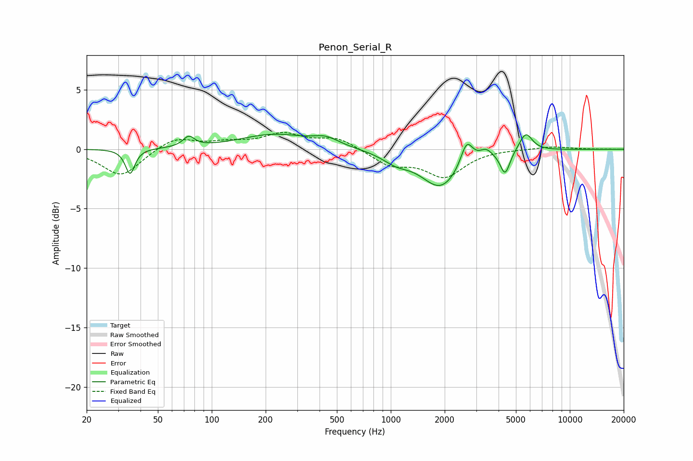

# Penon_Serial_R
See [usage instructions](https://github.com/jaakkopasanen/AutoEq#usage) for more options and info.

### Parametric EQs
Apply preamp of -1.4 dB when using parametric equalizer.

|   # | Type    |   Fc (Hz) |    Q |   Gain (dB) |
|-----|---------|-----------|------|-------------|
|   1 | Peaking |        35 | 5.59 |        -2.1 |
|   2 | Peaking |        74 | 4.52 |         0.9 |
|   3 | Peaking |       223 | 0.74 |         1.2 |
|   4 | Peaking |       434 | 1.94 |         0.7 |
|   5 | Peaking |      1071 | 1.85 |        -0.8 |
|   6 | Peaking |      1902 | 1.32 |        -3.2 |
|   7 | Peaking |      2653 | 4.29 |         2   |
|   8 | Peaking |      3401 | 4.18 |         0.7 |
|   9 | Peaking |      4350 | 5.2  |        -2   |
|  10 | Peaking |      5677 | 3.78 |         1.6 |

### Fixed Band EQs
When using fixed band (also called graphic) equalizer, apply preamp of **-1.5 dB** (if available) and set gains manually with these parameters.

|   # | Type    |   Fc (Hz) |    Q |   Gain (dB) |
|-----|---------|-----------|------|-------------|
|   1 | Peaking |        31 | 1.41 |        -2.3 |
|   2 | Peaking |        62 | 1.41 |         1   |
|   3 | Peaking |       125 | 1.41 |         0.5 |
|   4 | Peaking |       250 | 1.41 |         1.2 |
|   5 | Peaking |       500 | 1.41 |         0.9 |
|   6 | Peaking |      1000 | 1.41 |        -1.3 |
|   7 | Peaking |      2000 | 1.41 |        -2.2 |
|   8 | Peaking |      4000 | 1.41 |         0   |
|   9 | Peaking |      8000 | 1.41 |         0.2 |
|  10 | Peaking |     16000 | 1.41 |         0   |

### Graphs

