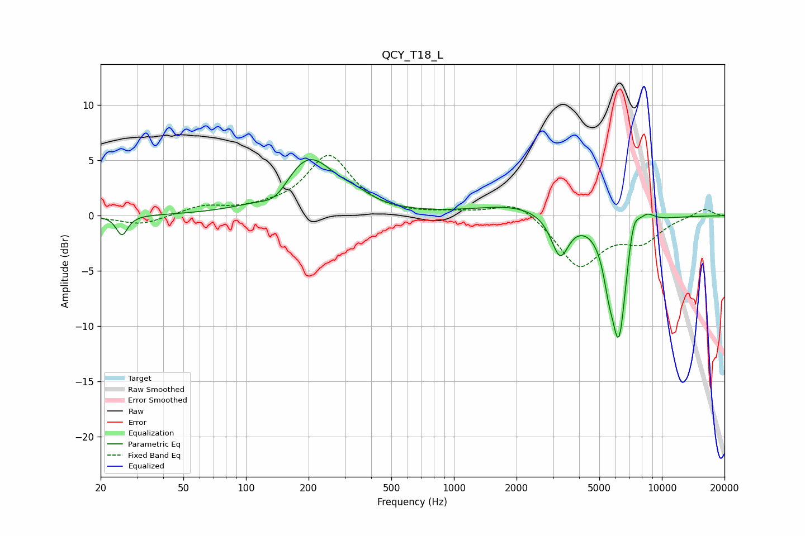

# QCY_T18_L
See [usage instructions](https://github.com/jaakkopasanen/AutoEq#usage) for more options and info.

### Parametric EQs
Apply preamp of -5.2 dB when using parametric equalizer.

|   # | Type    |   Fc (Hz) |    Q |   Gain (dB) |
|-----|---------|-----------|------|-------------|
|   1 | Peaking |        25 | 5.4  |        -1.8 |
|   2 | Peaking |       140 | 2.04 |        -1.5 |
|   3 | Peaking |       198 | 1.08 |         5.4 |
|   4 | Peaking |       339 | 2.06 |         0.6 |
|   5 | Peaking |      1994 | 0.74 |         1   |
|   6 | Peaking |      3236 | 3.33 |        -3.8 |
|   7 | Peaking |      5541 | 5.47 |        -2.2 |
|   8 | Peaking |      6214 | 3.46 |       -11.2 |
|   9 | Peaking |      7285 | 4.61 |         2.8 |
|  10 | Peaking |      8432 | 3.14 |         1.1 |

### Fixed Band EQs
When using fixed band (also called graphic) equalizer, apply preamp of **-5.5 dB** (if available) and set gains manually with these parameters.

|   # | Type    |   Fc (Hz) |    Q |   Gain (dB) |
|-----|---------|-----------|------|-------------|
|   1 | Peaking |        31 | 1.41 |        -0.9 |
|   2 | Peaking |        62 | 1.41 |         0.8 |
|   3 | Peaking |       125 | 1.41 |         0.4 |
|   4 | Peaking |       250 | 1.41 |         5.4 |
|   5 | Peaking |       500 | 1.41 |        -0   |
|   6 | Peaking |      1000 | 1.41 |         0.2 |
|   7 | Peaking |      2000 | 1.41 |         1.5 |
|   8 | Peaking |      4000 | 1.41 |        -4.6 |
|   9 | Peaking |      8000 | 1.41 |        -2.1 |
|  10 | Peaking |     16000 | 1.41 |         0.7 |

### Graphs

