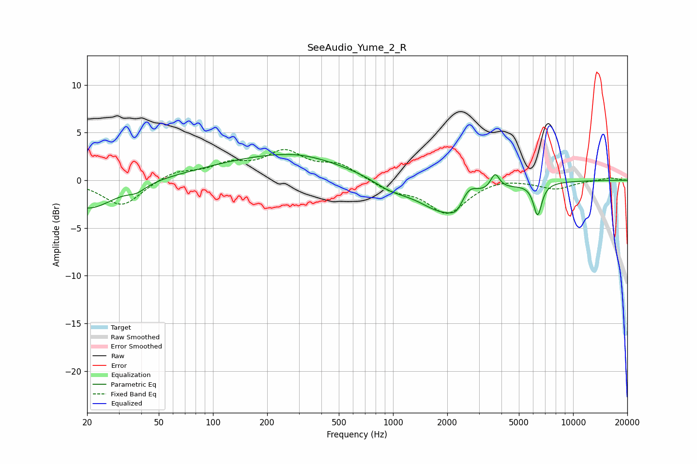

# SeeAudio_Yume_2_R
See [usage instructions](https://github.com/jaakkopasanen/AutoEq#usage) for more options and info.

### Parametric EQs
Apply preamp of -2.8 dB when using parametric equalizer.

|   # | Type    |   Fc (Hz) |    Q |   Gain (dB) |
|-----|---------|-----------|------|-------------|
|   1 | Peaking |        20 | 1    |        -3   |
|   2 | Peaking |        38 | 2.79 |        -0.7 |
|   3 | Peaking |       236 | 0.37 |         2.5 |
|   4 | Peaking |       306 | 0.96 |         0.4 |
|   5 | Peaking |       962 | 1.46 |        -0.9 |
|   6 | Peaking |      1995 | 0.94 |        -3.6 |
|   7 | Peaking |      2269 | 3.92 |        -0.9 |
|   8 | Peaking |      2626 | 2.76 |         1.9 |
|   9 | Peaking |      3688 | 5.73 |         1.7 |
|  10 | Peaking |      6354 | 5.98 |        -3.3 |

### Fixed Band EQs
When using fixed band (also called graphic) equalizer, apply preamp of **-3.3 dB** (if available) and set gains manually with these parameters.

|   # | Type    |   Fc (Hz) |    Q |   Gain (dB) |
|-----|---------|-----------|------|-------------|
|   1 | Peaking |        31 | 1.41 |        -2.8 |
|   2 | Peaking |        62 | 1.41 |         0.9 |
|   3 | Peaking |       125 | 1.41 |         1.4 |
|   4 | Peaking |       250 | 1.41 |         2.7 |
|   5 | Peaking |       500 | 1.41 |         1.5 |
|   6 | Peaking |      1000 | 1.41 |        -1   |
|   7 | Peaking |      2000 | 1.41 |        -3.4 |
|   8 | Peaking |      4000 | 1.41 |         0.4 |
|   9 | Peaking |      8000 | 1.41 |        -0.9 |
|  10 | Peaking |     16000 | 1.41 |         0.3 |

### Graphs

