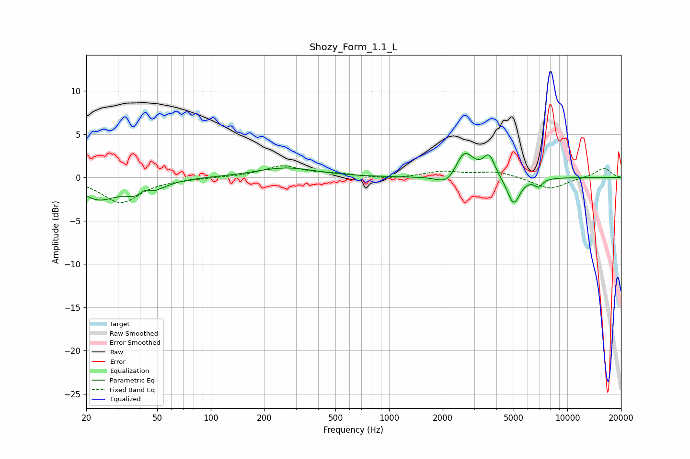

# Shozy_Form_1.1_L
See [usage instructions](https://github.com/jaakkopasanen/AutoEq#usage) for more options and info.

### Parametric EQs
Apply preamp of -2.9 dB when using parametric equalizer.

|   # | Type    |   Fc (Hz) |    Q |   Gain (dB) |
|-----|---------|-----------|------|-------------|
|   1 | Peaking |        23 | 1.42 |        -2.3 |
|   2 | Peaking |        38 | 2.16 |        -0.9 |
|   3 | Peaking |        43 | 4.92 |         0.8 |
|   4 | Peaking |        45 | 1.8  |        -1.2 |
|   5 | Peaking |       264 | 0.83 |         1.1 |
|   6 | Peaking |      2157 | 2.38 |        -1.6 |
|   7 | Peaking |      2632 | 2.63 |         3.4 |
|   8 | Peaking |      3633 | 4.33 |         2.4 |
|   9 | Peaking |      4992 | 3.87 |        -3.2 |
|  10 | Peaking |      6892 | 5.99 |        -0.9 |

### Fixed Band EQs
When using fixed band (also called graphic) equalizer, apply preamp of **-1.4 dB** (if available) and set gains manually with these parameters.

|   # | Type    |   Fc (Hz) |    Q |   Gain (dB) |
|-----|---------|-----------|------|-------------|
|   1 | Peaking |        31 | 1.41 |        -2.9 |
|   2 | Peaking |        62 | 1.41 |        -0.1 |
|   3 | Peaking |       125 | 1.41 |         0   |
|   4 | Peaking |       250 | 1.41 |         1.3 |
|   5 | Peaking |       500 | 1.41 |         0.4 |
|   6 | Peaking |      1000 | 1.41 |        -0.2 |
|   7 | Peaking |      2000 | 1.41 |         0.7 |
|   8 | Peaking |      4000 | 1.41 |         0.7 |
|   9 | Peaking |      8000 | 1.41 |        -1.4 |
|  10 | Peaking |     16000 | 1.41 |         1.1 |

### Graphs

