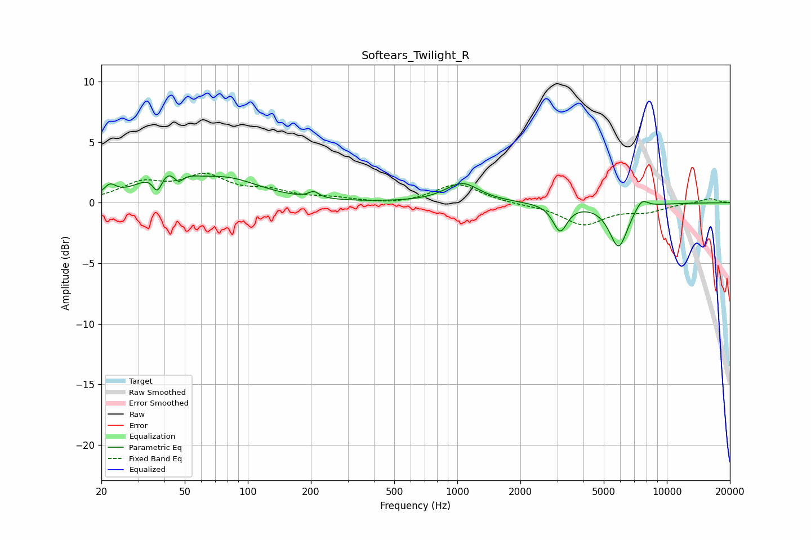

# Softears_Twilight_R
See [usage instructions](https://github.com/jaakkopasanen/AutoEq#usage) for more options and info.

### Parametric EQs
Apply preamp of -2.3 dB when using parametric equalizer.

|   # | Type    |   Fc (Hz) |    Q |   Gain (dB) |
|-----|---------|-----------|------|-------------|
|   1 | Peaking |        22 | 4.99 |         0.9 |
|   2 | Peaking |        37 | 6    |        -1.7 |
|   3 | Peaking |        40 | 1.45 |         2.5 |
|   4 | Peaking |        47 | 6    |        -0.9 |
|   5 | Peaking |        81 | 0.89 |         1.7 |
|   6 | Peaking |       207 | 5.97 |         0.5 |
|   7 | Peaking |      1057 | 1.76 |         1.6 |
|   8 | Peaking |      3094 | 4.22 |        -2.3 |
|   9 | Peaking |      5885 | 3.13 |        -3.6 |
|  10 | Peaking |      7583 | 4.4  |         0.9 |

### Fixed Band EQs
When using fixed band (also called graphic) equalizer, apply preamp of **-2.5 dB** (if available) and set gains manually with these parameters.

|   # | Type    |   Fc (Hz) |    Q |   Gain (dB) |
|-----|---------|-----------|------|-------------|
|   1 | Peaking |        31 | 1.41 |         1.5 |
|   2 | Peaking |        62 | 1.41 |         2   |
|   3 | Peaking |       125 | 1.41 |         0.8 |
|   4 | Peaking |       250 | 1.41 |         0.3 |
|   5 | Peaking |       500 | 1.41 |        -0.2 |
|   6 | Peaking |      1000 | 1.41 |         1.6 |
|   7 | Peaking |      2000 | 1.41 |        -0.1 |
|   8 | Peaking |      4000 | 1.41 |        -1.8 |
|   9 | Peaking |      8000 | 1.41 |        -0.6 |
|  10 | Peaking |     16000 | 1.41 |         0.4 |

### Graphs

