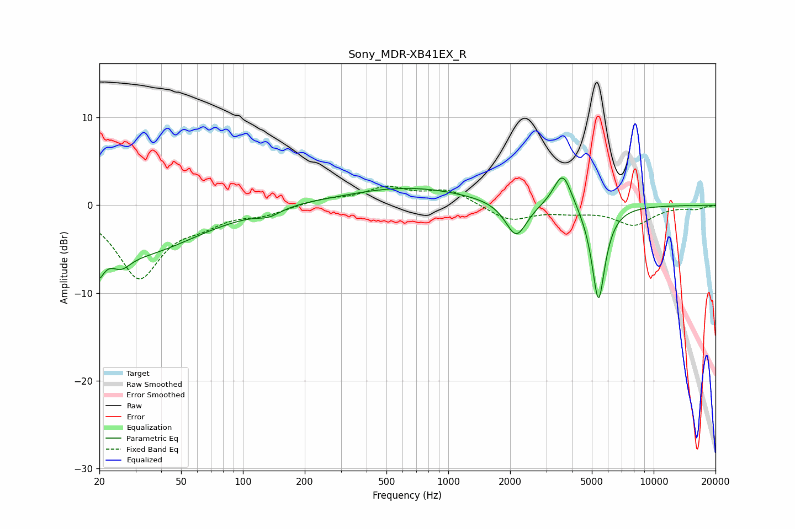

# Sony_MDR-XB41EX_R
See [usage instructions](https://github.com/jaakkopasanen/AutoEq#usage) for more options and info.

### Parametric EQs
Apply preamp of -3.2 dB when using parametric equalizer.

|   # | Type    |   Fc (Hz) |    Q |   Gain (dB) |
|-----|---------|-----------|------|-------------|
|   1 | Peaking |        20 | 5.5  |        -6.1 |
|   2 | Peaking |        20 | 6    |         2.8 |
|   3 | Peaking |        25 | 3    |        -1.7 |
|   4 | Peaking |        31 | 0.5  |        -5.4 |
|   5 | Peaking |       134 | 2.53 |        -0.7 |
|   6 | Peaking |       186 | 1.22 |         0.2 |
|   7 | Peaking |       630 | 0.46 |         2   |
|   8 | Peaking |      2142 | 2.72 |        -4   |
|   9 | Peaking |      3609 | 3.14 |         4.2 |
|  10 | Peaking |      5384 | 4.19 |       -11.1 |

### Fixed Band EQs
When using fixed band (also called graphic) equalizer, apply preamp of **-2.3 dB** (if available) and set gains manually with these parameters.

|   # | Type    |   Fc (Hz) |    Q |   Gain (dB) |
|-----|---------|-----------|------|-------------|
|   1 | Peaking |        31 | 1.41 |        -8.1 |
|   2 | Peaking |        62 | 1.41 |        -1.5 |
|   3 | Peaking |       125 | 1.41 |        -0.9 |
|   4 | Peaking |       250 | 1.41 |         0.7 |
|   5 | Peaking |       500 | 1.41 |         1.9 |
|   6 | Peaking |      1000 | 1.41 |         1.7 |
|   7 | Peaking |      2000 | 1.41 |        -1.8 |
|   8 | Peaking |      4000 | 1.41 |        -0.6 |
|   9 | Peaking |      8000 | 1.41 |        -2.1 |
|  10 | Peaking |     16000 | 1.41 |        -0.4 |

### Graphs

