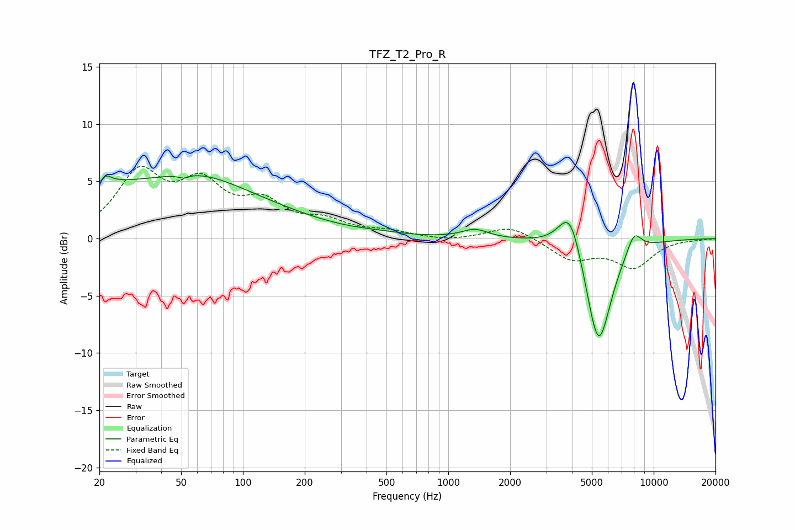

# TFZ_T2_Pro_R
See [usage instructions](https://github.com/jaakkopasanen/AutoEq#usage) for more options and info.

### Parametric EQs
Apply preamp of -5.6 dB when using parametric equalizer.

|   # | Type    |   Fc (Hz) |    Q |   Gain (dB) |
|-----|---------|-----------|------|-------------|
|   1 | Peaking |        20 | 5.98 |        -3   |
|   2 | Peaking |        21 | 5.24 |         3.4 |
|   3 | Peaking |        34 | 0.2  |         4.7 |
|   4 | Peaking |        51 | 5.97 |        -0.3 |
|   5 | Peaking |        63 | 0.81 |         1.1 |
|   6 | Peaking |       461 | 1.49 |         0.1 |
|   7 | Peaking |      1350 | 2.25 |         0.8 |
|   8 | Peaking |      3918 | 2.48 |         4.1 |
|   9 | Peaking |      5384 | 2.2  |        -9.7 |
|  10 | Peaking |      8022 | 3.57 |         1.9 |

### Fixed Band EQs
When using fixed band (also called graphic) equalizer, apply preamp of **-6.4 dB** (if available) and set gains manually with these parameters.

|   # | Type    |   Fc (Hz) |    Q |   Gain (dB) |
|-----|---------|-----------|------|-------------|
|   1 | Peaking |        31 | 1.41 |         5.4 |
|   2 | Peaking |        62 | 1.41 |         4.1 |
|   3 | Peaking |       125 | 1.41 |         2.6 |
|   4 | Peaking |       250 | 1.41 |         1.2 |
|   5 | Peaking |       500 | 1.41 |         0.5 |
|   6 | Peaking |      1000 | 1.41 |        -0.2 |
|   7 | Peaking |      2000 | 1.41 |         1.2 |
|   8 | Peaking |      4000 | 1.41 |        -1.8 |
|   9 | Peaking |      8000 | 1.41 |        -2.4 |
|  10 | Peaking |     16000 | 1.41 |        -0.1 |

### Graphs

