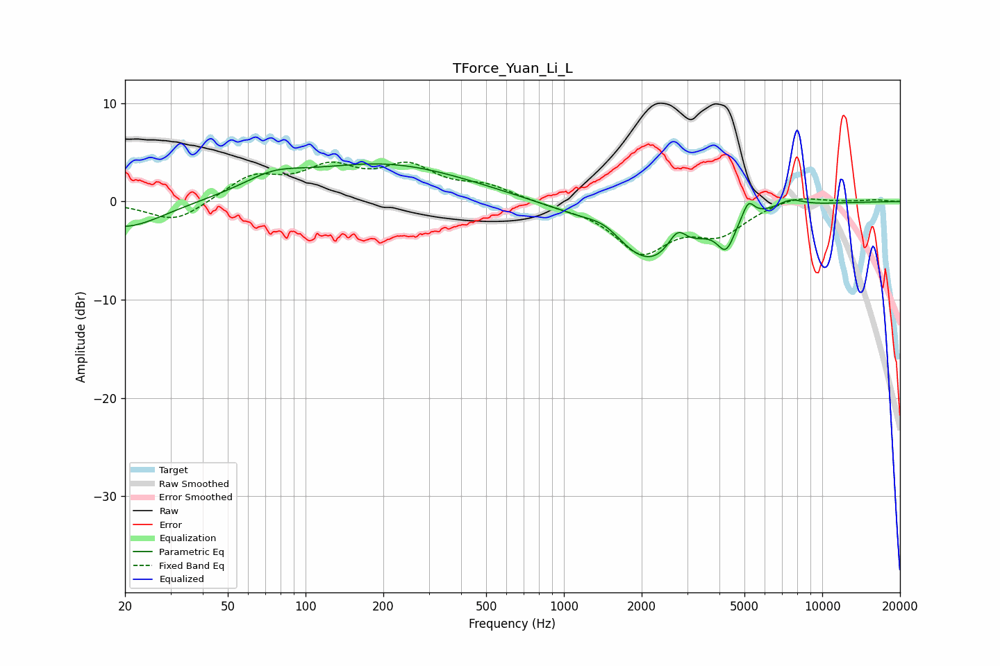

# TForce_Yuan_Li_L
See [usage instructions](https://github.com/jaakkopasanen/AutoEq#usage) for more options and info.

### Parametric EQs
Apply preamp of -3.9 dB when using parametric equalizer.

|   # | Type    |   Fc (Hz) |    Q |   Gain (dB) |
|-----|---------|-----------|------|-------------|
|   1 | Peaking |        20 | 0.93 |        -2.8 |
|   2 | Peaking |        75 | 1.23 |         1.5 |
|   3 | Peaking |       202 | 0.43 |         3.8 |
|   4 | Peaking |      1448 | 1.81 |         1.6 |
|   5 | Peaking |      2129 | 0.84 |        -6.7 |
|   6 | Peaking |      2764 | 3.66 |         2.8 |
|   7 | Peaking |      2899 | 2.78 |        -0.7 |
|   8 | Peaking |      4242 | 4.23 |        -2.8 |
|   9 | Peaking |      5173 | 6    |         1.8 |
|  10 | Peaking |      7531 | 2.68 |         0.8 |

### Fixed Band EQs
When using fixed band (also called graphic) equalizer, apply preamp of **-4.1 dB** (if available) and set gains manually with these parameters.

|   # | Type    |   Fc (Hz) |    Q |   Gain (dB) |
|-----|---------|-----------|------|-------------|
|   1 | Peaking |        31 | 1.41 |        -2.2 |
|   2 | Peaking |        62 | 1.41 |         2.4 |
|   3 | Peaking |       125 | 1.41 |         3   |
|   4 | Peaking |       250 | 1.41 |         3.2 |
|   5 | Peaking |       500 | 1.41 |         1.4 |
|   6 | Peaking |      1000 | 1.41 |        -0.3 |
|   7 | Peaking |      2000 | 1.41 |        -4.9 |
|   8 | Peaking |      4000 | 1.41 |        -2.9 |
|   9 | Peaking |      8000 | 1.41 |         0.8 |
|  10 | Peaking |     16000 | 1.41 |         0.2 |

### Graphs

