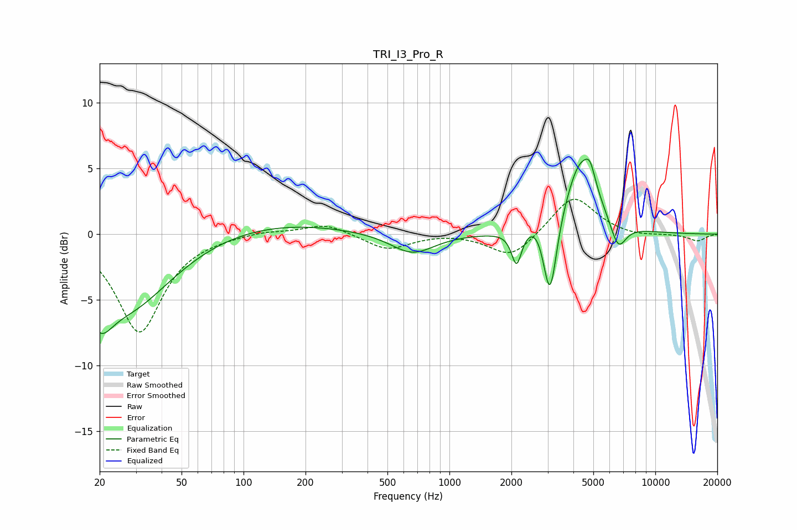

# TRI_I3_Pro_R
See [usage instructions](https://github.com/jaakkopasanen/AutoEq#usage) for more options and info.

### Parametric EQs
Apply preamp of -5.8 dB when using parametric equalizer.

|   # | Type    |   Fc (Hz) |    Q |   Gain (dB) |
|-----|---------|-----------|------|-------------|
|   1 | Peaking |        20 | 2.39 |        -2.9 |
|   2 | Peaking |        27 | 0.65 |        -5.5 |
|   3 | Peaking |       137 | 0.41 |         1   |
|   4 | Peaking |       661 | 1.34 |        -1.6 |
|   5 | Peaking |      2118 | 5.94 |        -2.6 |
|   6 | Peaking |      2661 | 2.95 |         0.9 |
|   7 | Peaking |      3079 | 4.27 |        -6.3 |
|   8 | Peaking |      4353 | 1.79 |         5.7 |
|   9 | Peaking |      4825 | 5.91 |         1.2 |
|  10 | Peaking |      6599 | 3.53 |        -2.2 |

### Fixed Band EQs
When using fixed band (also called graphic) equalizer, apply preamp of **-2.8 dB** (if available) and set gains manually with these parameters.

|   # | Type    |   Fc (Hz) |    Q |   Gain (dB) |
|-----|---------|-----------|------|-------------|
|   1 | Peaking |        31 | 1.41 |        -7.4 |
|   2 | Peaking |        62 | 1.41 |        -0.1 |
|   3 | Peaking |       125 | 1.41 |         0.3 |
|   4 | Peaking |       250 | 1.41 |         0.8 |
|   5 | Peaking |       500 | 1.41 |        -1.2 |
|   6 | Peaking |      1000 | 1.41 |         0.1 |
|   7 | Peaking |      2000 | 1.41 |        -1.9 |
|   8 | Peaking |      4000 | 1.41 |         3   |
|   9 | Peaking |      8000 | 1.41 |        -0.2 |
|  10 | Peaking |     16000 | 1.41 |        -0.5 |

### Graphs

