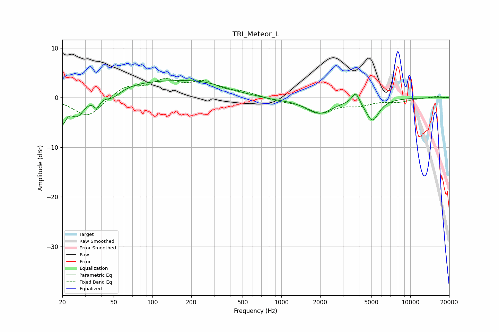

# TRI_Meteor_L
See [usage instructions](https://github.com/jaakkopasanen/AutoEq#usage) for more options and info.

### Parametric EQs
Apply preamp of -3.5 dB when using parametric equalizer.

|   # | Type    |   Fc (Hz) |    Q |   Gain (dB) |
|-----|---------|-----------|------|-------------|
|   1 | Peaking |        20 | 5.07 |        -4.4 |
|   2 | Peaking |        26 | 2.46 |        -4   |
|   3 | Peaking |        37 | 5.89 |        -2   |
|   4 | Peaking |        49 | 2.29 |        -1.7 |
|   5 | Peaking |       101 | 0.41 |         3   |
|   6 | Peaking |       254 | 0.79 |         1.5 |
|   7 | Peaking |       903 | 1.27 |        -0.3 |
|   8 | Peaking |      1962 | 1.37 |        -3.1 |
|   9 | Peaking |      3771 | 4.89 |         2.4 |
|  10 | Peaking |      5081 | 2.74 |        -4.4 |

### Fixed Band EQs
When using fixed band (also called graphic) equalizer, apply preamp of **-3.9 dB** (if available) and set gains manually with these parameters.

|   # | Type    |   Fc (Hz) |    Q |   Gain (dB) |
|-----|---------|-----------|------|-------------|
|   1 | Peaking |        31 | 1.41 |        -4   |
|   2 | Peaking |        62 | 1.41 |         2.2 |
|   3 | Peaking |       125 | 1.41 |         3.1 |
|   4 | Peaking |       250 | 1.41 |         2.7 |
|   5 | Peaking |       500 | 1.41 |         0.9 |
|   6 | Peaking |      1000 | 1.41 |        -0.6 |
|   7 | Peaking |      2000 | 1.41 |        -2.9 |
|   8 | Peaking |      4000 | 1.41 |        -1.2 |
|   9 | Peaking |      8000 | 1.41 |        -0.7 |
|  10 | Peaking |     16000 | 1.41 |         0.3 |

### Graphs

