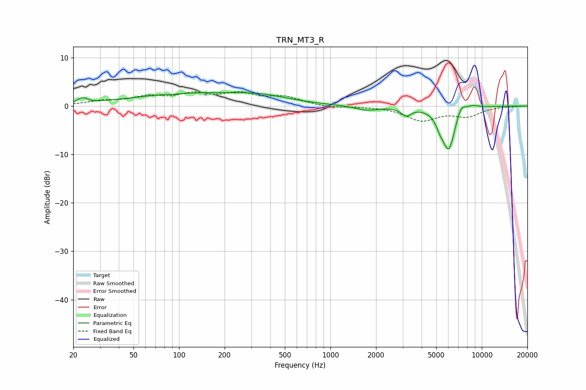

# TRN_MT3_R
See [usage instructions](https://github.com/jaakkopasanen/AutoEq#usage) for more options and info.

### Parametric EQs
Apply preamp of -2.9 dB when using parametric equalizer.

|   # | Type    |   Fc (Hz) |    Q |   Gain (dB) |
|-----|---------|-----------|------|-------------|
|   1 | Peaking |        23 | 4.59 |         1.1 |
|   2 | Peaking |        91 | 6    |        -0.1 |
|   3 | Peaking |       118 | 0.34 |         2.4 |
|   4 | Peaking |       355 | 0.77 |         1.2 |
|   5 | Peaking |      1737 | 1.89 |        -0.9 |
|   6 | Peaking |      3169 | 4.52 |        -1.6 |
|   7 | Peaking |      5298 | 5.25 |        -1.8 |
|   8 | Peaking |      6055 | 3.3  |        -8.8 |
|   9 | Peaking |      7295 | 4.47 |         2.2 |
|  10 | Peaking |      8679 | 3.1  |         0.7 |

### Fixed Band EQs
When using fixed band (also called graphic) equalizer, apply preamp of **-3.1 dB** (if available) and set gains manually with these parameters.

|   # | Type    |   Fc (Hz) |    Q |   Gain (dB) |
|-----|---------|-----------|------|-------------|
|   1 | Peaking |        31 | 1.41 |         0.9 |
|   2 | Peaking |        62 | 1.41 |         1.6 |
|   3 | Peaking |       125 | 1.41 |         2.1 |
|   4 | Peaking |       250 | 1.41 |         2.2 |
|   5 | Peaking |       500 | 1.41 |         1.7 |
|   6 | Peaking |      1000 | 1.41 |        -0.4 |
|   7 | Peaking |      2000 | 1.41 |        -0   |
|   8 | Peaking |      4000 | 1.41 |        -2.9 |
|   9 | Peaking |      8000 | 1.41 |        -1.9 |
|  10 | Peaking |     16000 | 1.41 |        -0.1 |

### Graphs

