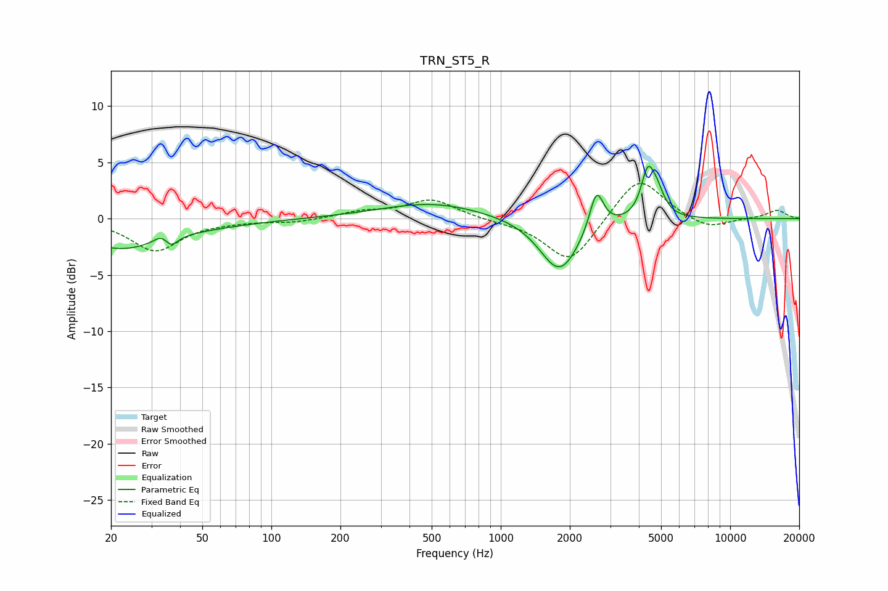

# TRN_ST5_R
See [usage instructions](https://github.com/jaakkopasanen/AutoEq#usage) for more options and info.

### Parametric EQs
Apply preamp of -4.8 dB when using parametric equalizer.

|   # | Type    |   Fc (Hz) |    Q |   Gain (dB) |
|-----|---------|-----------|------|-------------|
|   1 | Peaking |        22 | 0.78 |        -2.6 |
|   2 | Peaking |        33 | 4.44 |         0.7 |
|   3 | Peaking |        36 | 4.94 |        -1   |
|   4 | Peaking |        55 | 0.66 |        -0.3 |
|   5 | Peaking |       503 | 0.62 |         1.4 |
|   6 | Peaking |      1757 | 1.76 |        -0.6 |
|   7 | Peaking |      1813 | 1.65 |        -4.2 |
|   8 | Peaking |      2615 | 4.66 |         3.6 |
|   9 | Peaking |      4369 | 4.89 |         3.7 |
|  10 | Peaking |      4792 | 4.31 |         1.9 |

### Fixed Band EQs
When using fixed band (also called graphic) equalizer, apply preamp of **-3.2 dB** (if available) and set gains manually with these parameters.

|   # | Type    |   Fc (Hz) |    Q |   Gain (dB) |
|-----|---------|-----------|------|-------------|
|   1 | Peaking |        31 | 1.41 |        -2.8 |
|   2 | Peaking |        62 | 1.41 |        -0.2 |
|   3 | Peaking |       125 | 1.41 |        -0.3 |
|   4 | Peaking |       250 | 1.41 |         0.6 |
|   5 | Peaking |       500 | 1.41 |         1.7 |
|   6 | Peaking |      1000 | 1.41 |        -0.2 |
|   7 | Peaking |      2000 | 1.41 |        -4   |
|   8 | Peaking |      4000 | 1.41 |         4   |
|   9 | Peaking |      8000 | 1.41 |        -1   |
|  10 | Peaking |     16000 | 1.41 |         0.8 |

### Graphs

