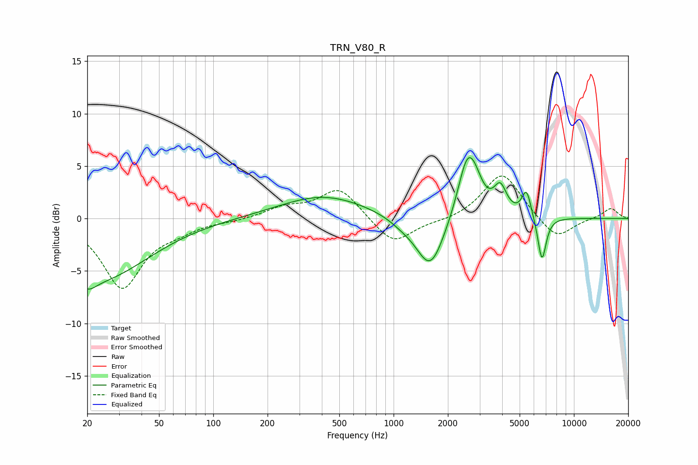

# TRN_V80_R
See [usage instructions](https://github.com/jaakkopasanen/AutoEq#usage) for more options and info.

### Parametric EQs
Apply preamp of -5.9 dB when using parametric equalizer.

|   # | Type    |   Fc (Hz) |    Q |   Gain (dB) |
|-----|---------|-----------|------|-------------|
|   1 | Peaking |        20 | 2.92 |        -1.3 |
|   2 | Peaking |        24 | 0.52 |        -5.6 |
|   3 | Peaking |       408 | 0.58 |         2.2 |
|   4 | Peaking |      1115 | 1.94 |        -0.5 |
|   5 | Peaking |      1600 | 1.79 |        -5.1 |
|   6 | Peaking |      2565 | 2.58 |         5.9 |
|   7 | Peaking |      2851 | 3.57 |         1.2 |
|   8 | Peaking |      3904 | 4.02 |         2.5 |
|   9 | Peaking |      5460 | 5.32 |         2.6 |
|  10 | Peaking |      6648 | 5.79 |        -4.3 |

### Fixed Band EQs
When using fixed band (also called graphic) equalizer, apply preamp of **-4.1 dB** (if available) and set gains manually with these parameters.

|   # | Type    |   Fc (Hz) |    Q |   Gain (dB) |
|-----|---------|-----------|------|-------------|
|   1 | Peaking |        31 | 1.41 |        -6.5 |
|   2 | Peaking |        62 | 1.41 |        -0.8 |
|   3 | Peaking |       125 | 1.41 |        -0.2 |
|   4 | Peaking |       250 | 1.41 |         1   |
|   5 | Peaking |       500 | 1.41 |         2.9 |
|   6 | Peaking |      1000 | 1.41 |        -2.6 |
|   7 | Peaking |      2000 | 1.41 |        -0.3 |
|   8 | Peaking |      4000 | 1.41 |         4.4 |
|   9 | Peaking |      8000 | 1.41 |        -2.1 |
|  10 | Peaking |     16000 | 1.41 |         1   |

### Graphs

