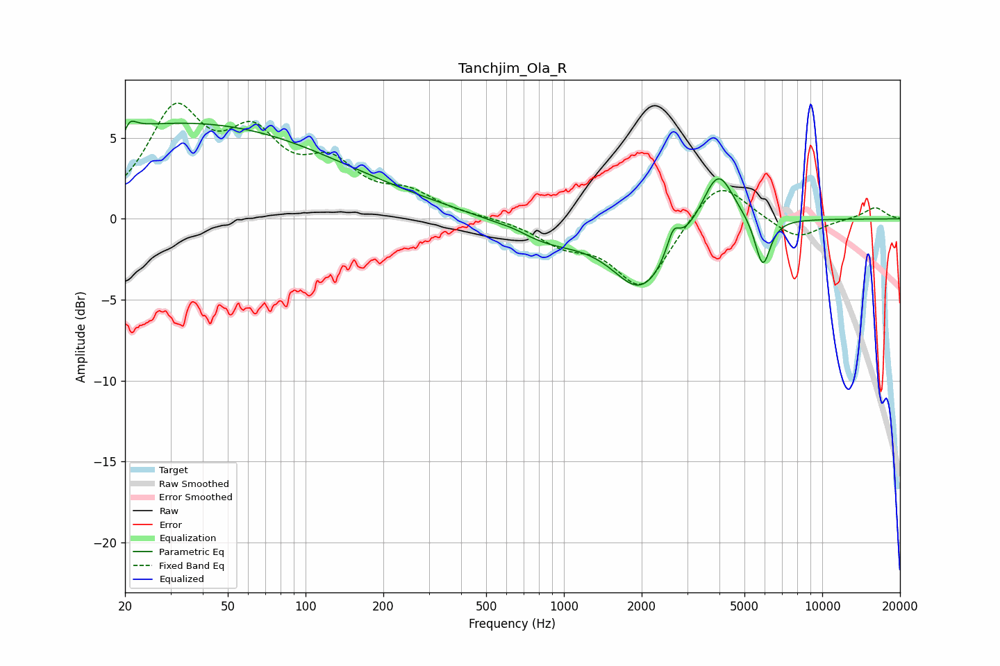

# Tanchjim_Ola_R
See [usage instructions](https://github.com/jaakkopasanen/AutoEq#usage) for more options and info.

### Parametric EQs
Apply preamp of -6.1 dB when using parametric equalizer.

|   # | Type    |   Fc (Hz) |    Q |   Gain (dB) |
|-----|---------|-----------|------|-------------|
|   1 | Peaking |        20 | 5.97 |        -3.4 |
|   2 | Peaking |        20 | 5.83 |         3.3 |
|   3 | Peaking |        23 | 0.18 |         4.9 |
|   4 | Peaking |        77 | 0.24 |         1.3 |
|   5 | Peaking |       638 | 2.71 |         0.2 |
|   6 | Peaking |       862 | 0.93 |        -1.2 |
|   7 | Peaking |      2000 | 1.24 |        -4.2 |
|   8 | Peaking |      2650 | 5.72 |         1.5 |
|   9 | Peaking |      3947 | 2.29 |         3.6 |
|  10 | Peaking |      5885 | 4.63 |        -3.1 |

### Fixed Band EQs
When using fixed band (also called graphic) equalizer, apply preamp of **-7.2 dB** (if available) and set gains manually with these parameters.

|   # | Type    |   Fc (Hz) |    Q |   Gain (dB) |
|-----|---------|-----------|------|-------------|
|   1 | Peaking |        31 | 1.41 |         6.2 |
|   2 | Peaking |        62 | 1.41 |         4.3 |
|   3 | Peaking |       125 | 1.41 |         2.8 |
|   4 | Peaking |       250 | 1.41 |         1.3 |
|   5 | Peaking |       500 | 1.41 |         0.1 |
|   6 | Peaking |      1000 | 1.41 |        -1.3 |
|   7 | Peaking |      2000 | 1.41 |        -4.2 |
|   8 | Peaking |      4000 | 1.41 |         2.7 |
|   9 | Peaking |      8000 | 1.41 |        -1.3 |
|  10 | Peaking |     16000 | 1.41 |         0.7 |

### Graphs

