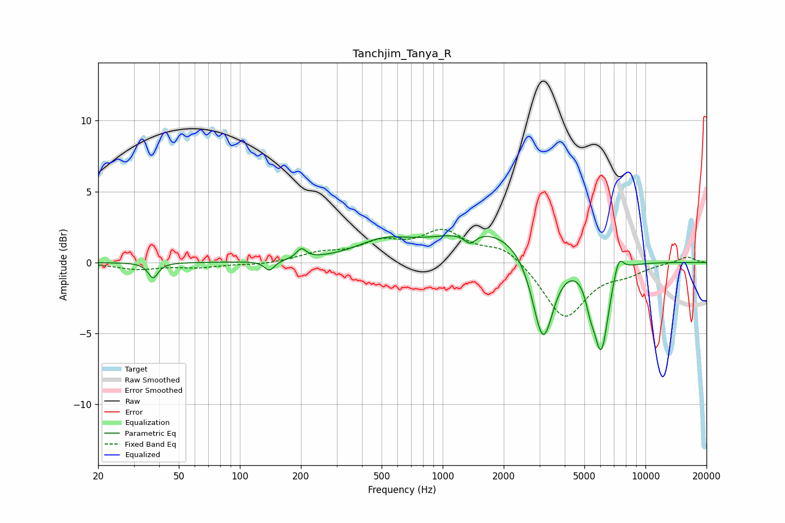

# Tanchjim_Tanya_R
See [usage instructions](https://github.com/jaakkopasanen/AutoEq#usage) for more options and info.

### Parametric EQs
Apply preamp of -2.0 dB when using parametric equalizer.

|   # | Type    |   Fc (Hz) |    Q |   Gain (dB) |
|-----|---------|-----------|------|-------------|
|   1 | Peaking |        37 | 5.99 |        -1.1 |
|   2 | Peaking |       140 | 5.87 |        -0.7 |
|   3 | Peaking |       201 | 6    |         0.7 |
|   4 | Peaking |       506 | 1.07 |         1.1 |
|   5 | Peaking |      1364 | 4.83 |        -0.8 |
|   6 | Peaking |      1778 | 0.51 |         2.4 |
|   7 | Peaking |      3125 | 2.67 |        -6.6 |
|   8 | Peaking |      5337 | 6    |        -1.3 |
|   9 | Peaking |      6050 | 3.68 |        -6.2 |
|  10 | Peaking |      7373 | 5.36 |         1.4 |

### Fixed Band EQs
When using fixed band (also called graphic) equalizer, apply preamp of **-2.4 dB** (if available) and set gains manually with these parameters.

|   # | Type    |   Fc (Hz) |    Q |   Gain (dB) |
|-----|---------|-----------|------|-------------|
|   1 | Peaking |        31 | 1.41 |        -0.4 |
|   2 | Peaking |        62 | 1.41 |        -0.3 |
|   3 | Peaking |       125 | 1.41 |        -0.2 |
|   4 | Peaking |       250 | 1.41 |         0.6 |
|   5 | Peaking |       500 | 1.41 |         1.2 |
|   6 | Peaking |      1000 | 1.41 |         2   |
|   7 | Peaking |      2000 | 1.41 |         1.1 |
|   8 | Peaking |      4000 | 1.41 |        -4   |
|   9 | Peaking |      8000 | 1.41 |        -0.6 |
|  10 | Peaking |     16000 | 1.41 |         0.4 |

### Graphs

