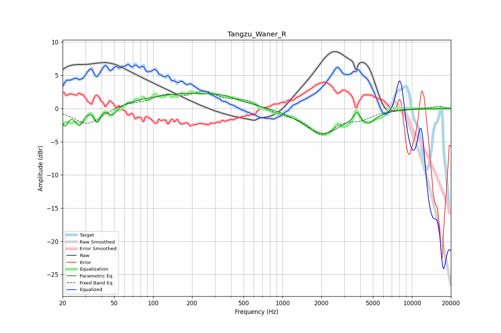

# Tangzu_Waner_R
See [usage instructions](https://github.com/jaakkopasanen/AutoEq#usage) for more options and info.

### Parametric EQs
Apply preamp of -2.4 dB when using parametric equalizer.

|   # | Type    |   Fc (Hz) |    Q |   Gain (dB) |
|-----|---------|-----------|------|-------------|
|   1 | Peaking |        21 | 5.78 |        -2.4 |
|   2 | Peaking |        27 | 4.57 |        -2.5 |
|   3 | Peaking |        37 | 5.95 |        -2.3 |
|   4 | Peaking |        39 | 2.98 |         0.3 |
|   5 | Peaking |        49 | 4.1  |        -1.5 |
|   6 | Peaking |       182 | 0.41 |         2.2 |
|   7 | Peaking |       347 | 1.68 |         0.4 |
|   8 | Peaking |      2040 | 0.97 |        -3.8 |
|   9 | Peaking |      3767 | 6    |         1.5 |
|  10 | Peaking |      4567 | 2.52 |        -1.5 |

### Fixed Band EQs
When using fixed band (also called graphic) equalizer, apply preamp of **-2.7 dB** (if available) and set gains manually with these parameters.

|   # | Type    |   Fc (Hz) |    Q |   Gain (dB) |
|-----|---------|-----------|------|-------------|
|   1 | Peaking |        31 | 1.41 |        -2.4 |
|   2 | Peaking |        62 | 1.41 |         0.7 |
|   3 | Peaking |       125 | 1.41 |         1.7 |
|   4 | Peaking |       250 | 1.41 |         2.1 |
|   5 | Peaking |       500 | 1.41 |         1.1 |
|   6 | Peaking |      1000 | 1.41 |        -0.6 |
|   7 | Peaking |      2000 | 1.41 |        -3.7 |
|   8 | Peaking |      4000 | 1.41 |        -1.3 |
|   9 | Peaking |      8000 | 1.41 |         0.1 |
|  10 | Peaking |     16000 | 1.41 |         0.3 |

### Graphs

