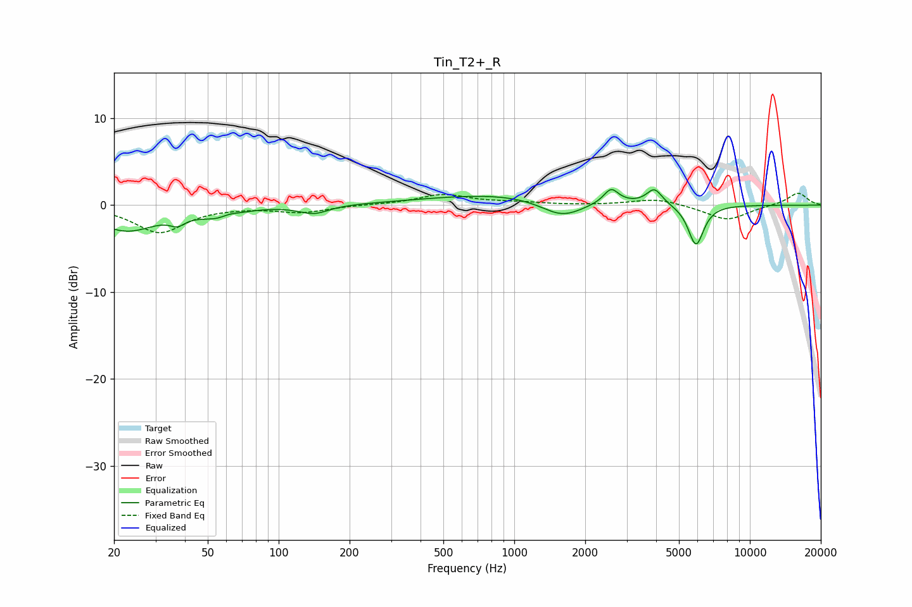

# Tin_T2+_R
See [usage instructions](https://github.com/jaakkopasanen/AutoEq#usage) for more options and info.

### Parametric EQs
Apply preamp of -1.9 dB when using parametric equalizer.

|   # | Type    |   Fc (Hz) |    Q |   Gain (dB) |
|-----|---------|-----------|------|-------------|
|   1 | Peaking |        23 | 1.11 |        -2.9 |
|   2 | Peaking |        37 | 4.5  |        -0.9 |
|   3 | Peaking |        55 | 1.75 |        -1.1 |
|   4 | Peaking |        62 | 4.2  |         0.3 |
|   5 | Peaking |       141 | 2.28 |        -1   |
|   6 | Peaking |       973 | 0.41 |         1.4 |
|   7 | Peaking |      1598 | 1.5  |        -2.2 |
|   8 | Peaking |      2576 | 4.51 |         1.7 |
|   9 | Peaking |      3935 | 4.32 |         1.8 |
|  10 | Peaking |      5905 | 4.22 |        -4.7 |

### Fixed Band EQs
When using fixed band (also called graphic) equalizer, apply preamp of **-1.5 dB** (if available) and set gains manually with these parameters.

|   # | Type    |   Fc (Hz) |    Q |   Gain (dB) |
|-----|---------|-----------|------|-------------|
|   1 | Peaking |        31 | 1.41 |        -3.1 |
|   2 | Peaking |        62 | 1.41 |        -0.1 |
|   3 | Peaking |       125 | 1.41 |        -0.8 |
|   4 | Peaking |       250 | 1.41 |         0   |
|   5 | Peaking |       500 | 1.41 |         1.2 |
|   6 | Peaking |      1000 | 1.41 |         0.3 |
|   7 | Peaking |      2000 | 1.41 |        -0   |
|   8 | Peaking |      4000 | 1.41 |         0.8 |
|   9 | Peaking |      8000 | 1.41 |        -1.7 |
|  10 | Peaking |     16000 | 1.41 |         1.4 |

### Graphs

