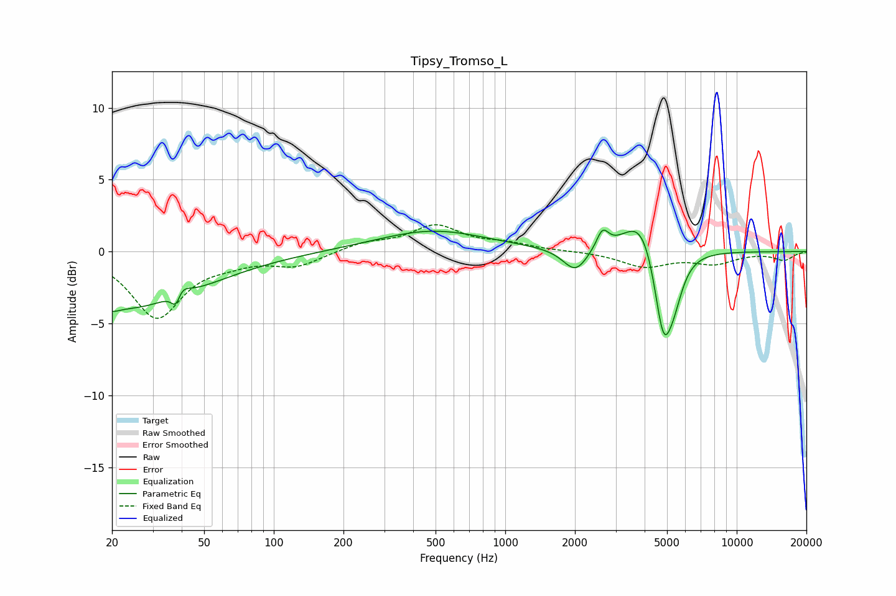

# Tipsy_Tromso_L
See [usage instructions](https://github.com/jaakkopasanen/AutoEq#usage) for more options and info.

### Parametric EQs
Apply preamp of -1.6 dB when using parametric equalizer.

|   # | Type    |   Fc (Hz) |    Q |   Gain (dB) |
|-----|---------|-----------|------|-------------|
|   1 | Peaking |        20 | 4.97 |        -0.3 |
|   2 | Peaking |        23 | 0.42 |        -3.9 |
|   3 | Peaking |        38 | 6    |        -2.8 |
|   4 | Peaking |        39 | 4.75 |         2.5 |
|   5 | Peaking |       485 | 0.6  |         1.5 |
|   6 | Peaking |      2010 | 2.67 |        -1.7 |
|   7 | Peaking |      2631 | 5.49 |         1.3 |
|   8 | Peaking |      3909 | 1.79 |         3   |
|   9 | Peaking |      4819 | 3.43 |        -6.2 |
|  10 | Peaking |      5377 | 3.47 |        -2   |

### Fixed Band EQs
When using fixed band (also called graphic) equalizer, apply preamp of **-2.0 dB** (if available) and set gains manually with these parameters.

|   # | Type    |   Fc (Hz) |    Q |   Gain (dB) |
|-----|---------|-----------|------|-------------|
|   1 | Peaking |        31 | 1.41 |        -4.5 |
|   2 | Peaking |        62 | 1.41 |        -0.5 |
|   3 | Peaking |       125 | 1.41 |        -1   |
|   4 | Peaking |       250 | 1.41 |         0.6 |
|   5 | Peaking |       500 | 1.41 |         1.7 |
|   6 | Peaking |      1000 | 1.41 |         0.5 |
|   7 | Peaking |      2000 | 1.41 |         0   |
|   8 | Peaking |      4000 | 1.41 |        -1   |
|   9 | Peaking |      8000 | 1.41 |        -0.8 |
|  10 | Peaking |     16000 | 1.41 |        -0.6 |

### Graphs

