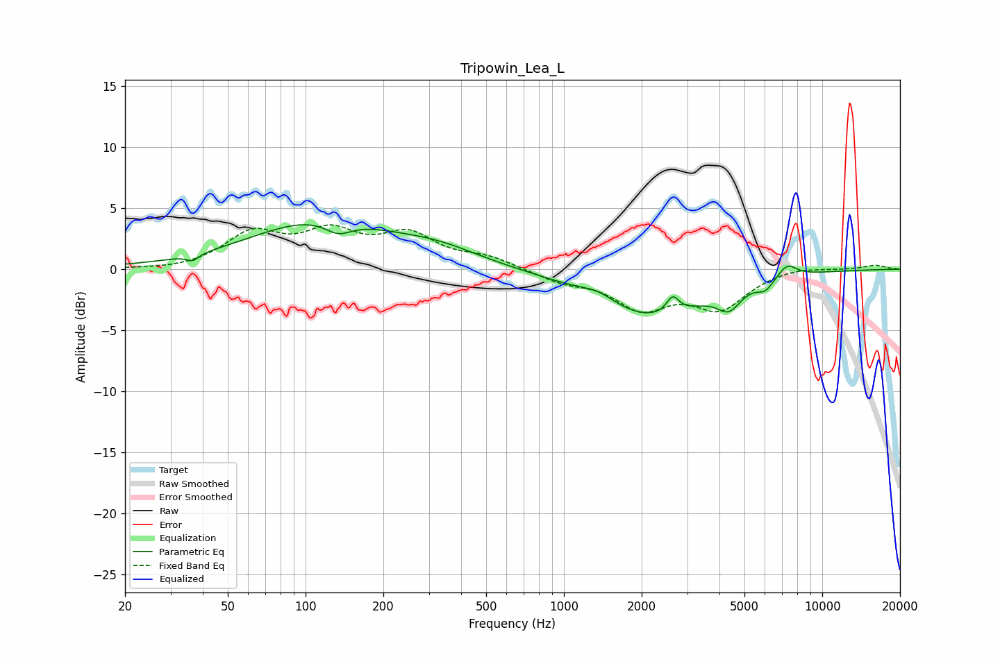

# Tripowin_Lea_L
See [usage instructions](https://github.com/jaakkopasanen/AutoEq#usage) for more options and info.

### Parametric EQs
Apply preamp of -3.7 dB when using parametric equalizer.

|   # | Type    |   Fc (Hz) |    Q |   Gain (dB) |
|-----|---------|-----------|------|-------------|
|   1 | Peaking |        37 | 5.99 |        -0.5 |
|   2 | Peaking |       114 | 0.53 |         3.9 |
|   3 | Peaking |       134 | 2.61 |        -1.1 |
|   4 | Peaking |       327 | 0.84 |         1.1 |
|   5 | Peaking |      1355 | 2.07 |         0.8 |
|   6 | Peaking |      2142 | 0.65 |        -3.9 |
|   7 | Peaking |      2639 | 5.98 |         1.4 |
|   8 | Peaking |      4358 | 3.13 |        -1.7 |
|   9 | Peaking |      6023 | 4.46 |        -0.8 |
|  10 | Peaking |      7316 | 3.57 |         1.1 |

### Fixed Band EQs
When using fixed band (also called graphic) equalizer, apply preamp of **-3.7 dB** (if available) and set gains manually with these parameters.

|   # | Type    |   Fc (Hz) |    Q |   Gain (dB) |
|-----|---------|-----------|------|-------------|
|   1 | Peaking |        31 | 1.41 |        -0.2 |
|   2 | Peaking |        62 | 1.41 |         2.8 |
|   3 | Peaking |       125 | 1.41 |         2.6 |
|   4 | Peaking |       250 | 1.41 |         2.6 |
|   5 | Peaking |       500 | 1.41 |         0.9 |
|   6 | Peaking |      1000 | 1.41 |        -0.9 |
|   7 | Peaking |      2000 | 1.41 |        -2.9 |
|   8 | Peaking |      4000 | 1.41 |        -3   |
|   9 | Peaking |      8000 | 1.41 |         0.3 |
|  10 | Peaking |     16000 | 1.41 |         0.3 |

### Graphs

