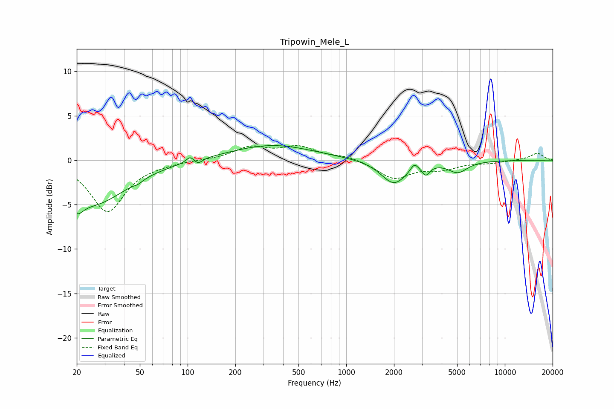

# Tripowin_Mele_L
See [usage instructions](https://github.com/jaakkopasanen/AutoEq#usage) for more options and info.

### Parametric EQs
Apply preamp of -1.7 dB when using parametric equalizer.

|   # | Type    |   Fc (Hz) |    Q |   Gain (dB) |
|-----|---------|-----------|------|-------------|
|   1 | Peaking |        20 | 3.72 |        -1.7 |
|   2 | Peaking |        25 | 0.67 |        -4.8 |
|   3 | Peaking |        49 | 5.86 |        -0.2 |
|   4 | Peaking |       104 | 5.98 |         0.6 |
|   5 | Peaking |       117 | 5.92 |        -0.5 |
|   6 | Peaking |       340 | 0.54 |         1.7 |
|   7 | Peaking |      1996 | 1.77 |        -2.7 |
|   8 | Peaking |      2689 | 6    |         0.9 |
|   9 | Peaking |      3178 | 6    |        -1.1 |
|  10 | Peaking |      5049 | 2.35 |        -1.3 |

### Fixed Band EQs
When using fixed band (also called graphic) equalizer, apply preamp of **-1.7 dB** (if available) and set gains manually with these parameters.

|   # | Type    |   Fc (Hz) |    Q |   Gain (dB) |
|-----|---------|-----------|------|-------------|
|   1 | Peaking |        31 | 1.41 |        -5.7 |
|   2 | Peaking |        62 | 1.41 |        -0.2 |
|   3 | Peaking |       125 | 1.41 |         0   |
|   4 | Peaking |       250 | 1.41 |         1.4 |
|   5 | Peaking |       500 | 1.41 |         1.4 |
|   6 | Peaking |      1000 | 1.41 |         0.5 |
|   7 | Peaking |      2000 | 1.41 |        -2   |
|   8 | Peaking |      4000 | 1.41 |        -0.9 |
|   9 | Peaking |      8000 | 1.41 |        -0.3 |
|  10 | Peaking |     16000 | 1.41 |         0.8 |

### Graphs

