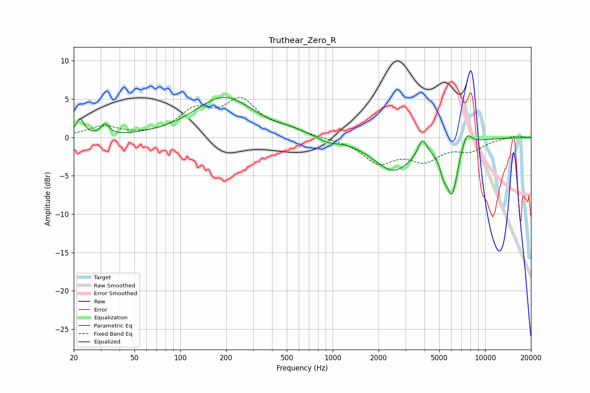

# Truthear_Zero_R
See [usage instructions](https://github.com/jaakkopasanen/AutoEq#usage) for more options and info.

### Parametric EQs
Apply preamp of -5.3 dB when using parametric equalizer.

|   # | Type    |   Fc (Hz) |    Q |   Gain (dB) |
|-----|---------|-----------|------|-------------|
|   1 | Peaking |        22 | 5.46 |         2.2 |
|   2 | Peaking |        32 | 5.62 |         1.4 |
|   3 | Peaking |       194 | 0.74 |         5.2 |
|   4 | Peaking |       534 | 1.57 |         0.4 |
|   5 | Peaking |       929 | 2.4  |        -0.6 |
|   6 | Peaking |      2500 | 1.07 |        -4.3 |
|   7 | Peaking |      3878 | 4.99 |         2.2 |
|   8 | Peaking |      5316 | 5.98 |        -1.8 |
|   9 | Peaking |      6071 | 3.55 |        -6.7 |
|  10 | Peaking |      7556 | 4.05 |         2.1 |

### Fixed Band EQs
When using fixed band (also called graphic) equalizer, apply preamp of **-5.3 dB** (if available) and set gains manually with these parameters.

|   # | Type    |   Fc (Hz) |    Q |   Gain (dB) |
|-----|---------|-----------|------|-------------|
|   1 | Peaking |        31 | 1.41 |         1.4 |
|   2 | Peaking |        62 | 1.41 |         0.1 |
|   3 | Peaking |       125 | 1.41 |         3.2 |
|   4 | Peaking |       250 | 1.41 |         4.5 |
|   5 | Peaking |       500 | 1.41 |         0.8 |
|   6 | Peaking |      1000 | 1.41 |        -0.1 |
|   7 | Peaking |      2000 | 1.41 |        -3.1 |
|   8 | Peaking |      4000 | 1.41 |        -2.6 |
|   9 | Peaking |      8000 | 1.41 |        -1.5 |
|  10 | Peaking |     16000 | 1.41 |         0.3 |

### Graphs

