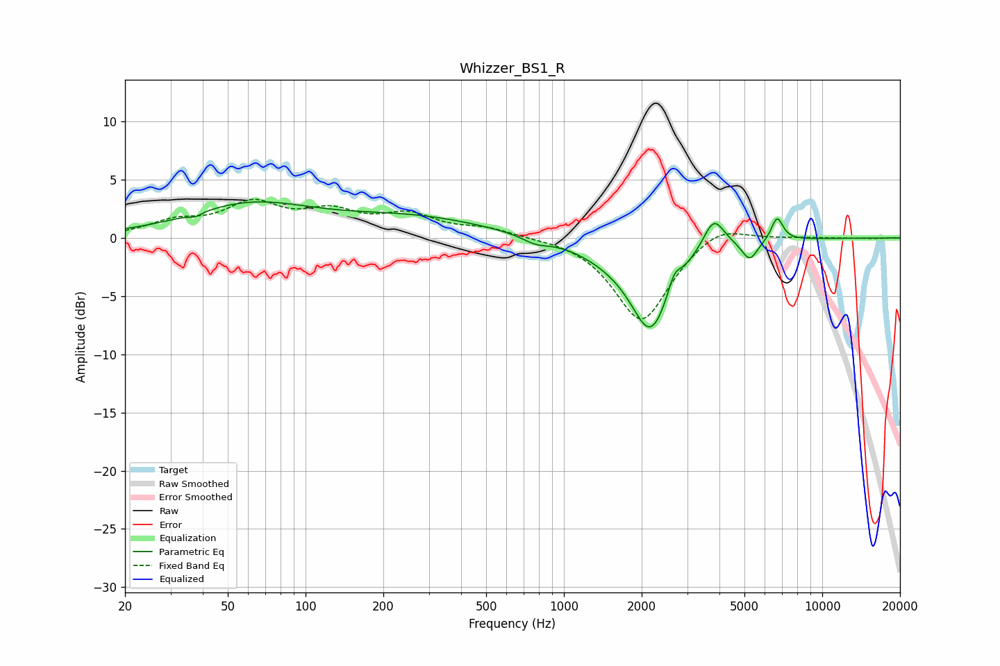

# Whizzer_BS1_R
See [usage instructions](https://github.com/jaakkopasanen/AutoEq#usage) for more options and info.

### Parametric EQs
Apply preamp of -3.2 dB when using parametric equalizer.

|   # | Type    |   Fc (Hz) |    Q |   Gain (dB) |
|-----|---------|-----------|------|-------------|
|   1 | Peaking |        37 | 6    |        -0.3 |
|   2 | Peaking |        61 | 0.59 |         2.7 |
|   3 | Peaking |       263 | 0.49 |         1.7 |
|   4 | Peaking |       776 | 2.77 |        -0.6 |
|   5 | Peaking |      1504 | 1.09 |        -0.9 |
|   6 | Peaking |      2168 | 1.81 |        -7.5 |
|   7 | Peaking |      2675 | 6    |         1.4 |
|   8 | Peaking |      3802 | 3.43 |         2.7 |
|   9 | Peaking |      5240 | 4.48 |        -1.7 |
|  10 | Peaking |      6690 | 6    |         2   |

### Fixed Band EQs
When using fixed band (also called graphic) equalizer, apply preamp of **-3.4 dB** (if available) and set gains manually with these parameters.

|   # | Type    |   Fc (Hz) |    Q |   Gain (dB) |
|-----|---------|-----------|------|-------------|
|   1 | Peaking |        31 | 1.41 |         1.2 |
|   2 | Peaking |        62 | 1.41 |         2.7 |
|   3 | Peaking |       125 | 1.41 |         1.9 |
|   4 | Peaking |       250 | 1.41 |         1.8 |
|   5 | Peaking |       500 | 1.41 |         0.8 |
|   6 | Peaking |      1000 | 1.41 |         0.2 |
|   7 | Peaking |      2000 | 1.41 |        -7.3 |
|   8 | Peaking |      4000 | 1.41 |         1.5 |
|   9 | Peaking |      8000 | 1.41 |         0.1 |
|  10 | Peaking |     16000 | 1.41 |        -0   |

### Graphs

