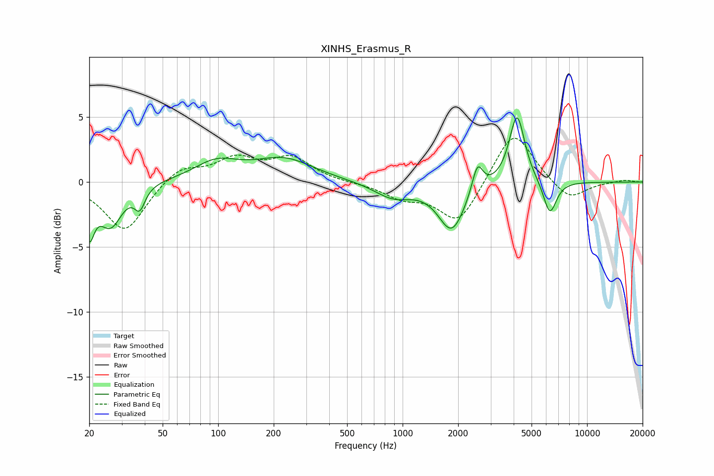

# XINHS_Erasmus_R
See [usage instructions](https://github.com/jaakkopasanen/AutoEq#usage) for more options and info.

### Parametric EQs
Apply preamp of -5.0 dB when using parametric equalizer.

|   # | Type    |   Fc (Hz) |    Q |   Gain (dB) |
|-----|---------|-----------|------|-------------|
|   1 | Peaking |        20 | 5.41 |        -3.3 |
|   2 | Peaking |        26 | 2.24 |        -3.2 |
|   3 | Peaking |        38 | 5.02 |        -1.5 |
|   4 | Peaking |        98 | 1.17 |         1.4 |
|   5 | Peaking |       228 | 0.88 |         1.7 |
|   6 | Peaking |       888 | 1.38 |        -1.2 |
|   7 | Peaking |      1847 | 1.97 |        -3.7 |
|   8 | Peaking |      2546 | 4.93 |         2.2 |
|   9 | Peaking |      4170 | 3.36 |         5.3 |
|  10 | Peaking |      6284 | 3.84 |        -2.6 |

### Fixed Band EQs
When using fixed band (also called graphic) equalizer, apply preamp of **-3.5 dB** (if available) and set gains manually with these parameters.

|   # | Type    |   Fc (Hz) |    Q |   Gain (dB) |
|-----|---------|-----------|------|-------------|
|   1 | Peaking |        31 | 1.41 |        -3.8 |
|   2 | Peaking |        62 | 1.41 |         1.2 |
|   3 | Peaking |       125 | 1.41 |         1.7 |
|   4 | Peaking |       250 | 1.41 |         1.8 |
|   5 | Peaking |       500 | 1.41 |        -0   |
|   6 | Peaking |      1000 | 1.41 |        -1.1 |
|   7 | Peaking |      2000 | 1.41 |        -3.2 |
|   8 | Peaking |      4000 | 1.41 |         4.2 |
|   9 | Peaking |      8000 | 1.41 |        -1.5 |
|  10 | Peaking |     16000 | 1.41 |         0.2 |

### Graphs

