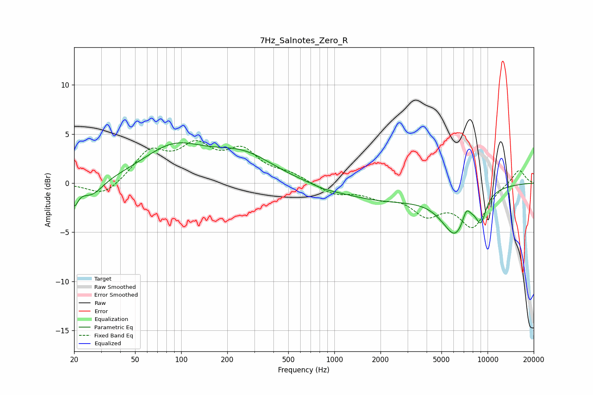

# 7Hz_Salnotes_Zero_R
See [usage instructions](https://github.com/jaakkopasanen/AutoEq#usage) for more options and info.

### Parametric EQs
Apply preamp of -4.2 dB when using parametric equalizer.

|   # | Type    |   Fc (Hz) |    Q |   Gain (dB) |
|-----|---------|-----------|------|-------------|
|   1 | Peaking |        20 | 5.7  |        -1.9 |
|   2 | Peaking |        26 | 1.92 |        -1.6 |
|   3 | Peaking |        89 | 0.69 |         3.4 |
|   4 | Peaking |       254 | 0.69 |         2.6 |
|   5 | Peaking |       859 | 1.95 |        -0.2 |
|   6 | Peaking |      2105 | 0.44 |        -1.7 |
|   7 | Peaking |      5560 | 2.49 |         0.5 |
|   8 | Peaking |      6045 | 1.57 |        -4.8 |
|   9 | Peaking |      7256 | 5.6  |         1.2 |
|  10 | Peaking |      9050 | 3.67 |        -2.5 |

### Fixed Band EQs
When using fixed band (also called graphic) equalizer, apply preamp of **-4.4 dB** (if available) and set gains manually with these parameters.

|   # | Type    |   Fc (Hz) |    Q |   Gain (dB) |
|-----|---------|-----------|------|-------------|
|   1 | Peaking |        31 | 1.41 |        -1.5 |
|   2 | Peaking |        62 | 1.41 |         3.1 |
|   3 | Peaking |       125 | 1.41 |         3.3 |
|   4 | Peaking |       250 | 1.41 |         2.9 |
|   5 | Peaking |       500 | 1.41 |         0.8 |
|   6 | Peaking |      1000 | 1.41 |        -1.1 |
|   7 | Peaking |      2000 | 1.41 |        -1.1 |
|   8 | Peaking |      4000 | 1.41 |        -2.7 |
|   9 | Peaking |      8000 | 1.41 |        -4.2 |
|  10 | Peaking |     16000 | 1.41 |         1.5 |

### Graphs

