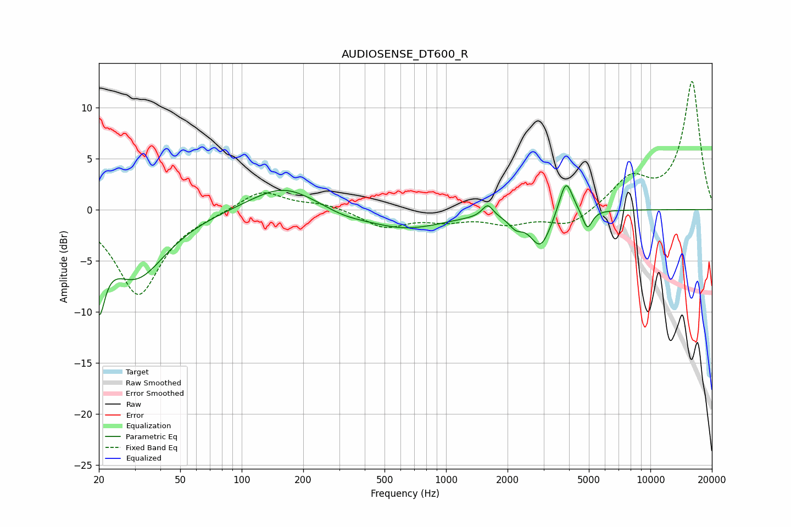

# AUDIOSENSE_DT600_R
See [usage instructions](https://github.com/jaakkopasanen/AutoEq#usage) for more options and info.

### Parametric EQs
Apply preamp of -2.4 dB when using parametric equalizer.

|   # | Type    |   Fc (Hz) |    Q |   Gain (dB) |
|-----|---------|-----------|------|-------------|
|   1 | Peaking |        20 | 4.93 |        -6.5 |
|   2 | Peaking |        30 | 0.95 |        -6.5 |
|   3 | Peaking |       159 | 0.89 |         2.5 |
|   4 | Peaking |       318 | 1.39 |        -0.5 |
|   5 | Peaking |       632 | 0.71 |        -1.9 |
|   6 | Peaking |      1598 | 5.38 |         1.2 |
|   7 | Peaking |      2196 | 4.19 |        -1   |
|   8 | Peaking |      2901 | 2.82 |        -3.5 |
|   9 | Peaking |      3862 | 4.31 |         3.5 |
|  10 | Peaking |      4917 | 6    |        -1.9 |

### Fixed Band EQs
When using fixed band (also called graphic) equalizer, apply preamp of **-12.6 dB** (if available) and set gains manually with these parameters.

|   # | Type    |   Fc (Hz) |    Q |   Gain (dB) |
|-----|---------|-----------|------|-------------|
|   1 | Peaking |        31 | 1.41 |        -8.3 |
|   2 | Peaking |        62 | 1.41 |        -0.3 |
|   3 | Peaking |       125 | 1.41 |         2   |
|   4 | Peaking |       250 | 1.41 |         0.6 |
|   5 | Peaking |       500 | 1.41 |        -1.7 |
|   6 | Peaking |      1000 | 1.41 |        -0.9 |
|   7 | Peaking |      2000 | 1.41 |        -1.2 |
|   8 | Peaking |      4000 | 1.41 |        -1.6 |
|   9 | Peaking |      8000 | 1.41 |         2.9 |
|  10 | Peaking |     16000 | 1.41 |        12.5 |

### Graphs

