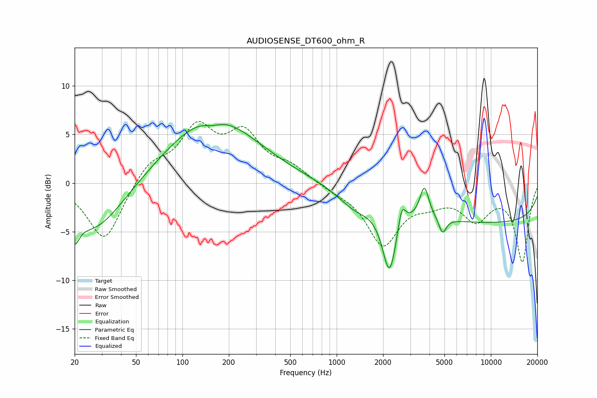

# AUDIOSENSE_DT600_ohm_R
See [usage instructions](https://github.com/jaakkopasanen/AutoEq#usage) for more options and info.

### Parametric EQs
Apply preamp of -6.1 dB when using parametric equalizer.

|   # | Type    |   Fc (Hz) |    Q |   Gain (dB) |
|-----|---------|-----------|------|-------------|
|   1 | Peaking |        20 | 4.95 |        -2.4 |
|   2 | Peaking |        27 | 0.73 |        -5.2 |
|   3 | Peaking |       155 | 0.49 |         6.9 |
|   4 | Peaking |       156 | 2.35 |        -0.6 |
|   5 | Peaking |      1312 | 1.26 |        -1.7 |
|   6 | Peaking |      2200 | 3.12 |        -6.7 |
|   7 | Peaking |      2644 | 5.88 |         2.4 |
|   8 | Peaking |      3707 | 4.87 |         3.2 |
|   9 | Peaking |      4860 | 6    |        -1.6 |
|  10 | Peaking |     10000 | 0.18 |        -4   |

### Fixed Band EQs
When using fixed band (also called graphic) equalizer, apply preamp of **-6.4 dB** (if available) and set gains manually with these parameters.

|   # | Type    |   Fc (Hz) |    Q |   Gain (dB) |
|-----|---------|-----------|------|-------------|
|   1 | Peaking |        31 | 1.41 |        -6.1 |
|   2 | Peaking |        62 | 1.41 |         2.1 |
|   3 | Peaking |       125 | 1.41 |         5.3 |
|   4 | Peaking |       250 | 1.41 |         4.6 |
|   5 | Peaking |       500 | 1.41 |         1.5 |
|   6 | Peaking |      1000 | 1.41 |        -0.5 |
|   7 | Peaking |      2000 | 1.41 |        -6.1 |
|   8 | Peaking |      4000 | 1.41 |        -1.3 |
|   9 | Peaking |      8000 | 1.41 |        -3.4 |
|  10 | Peaking |     16000 | 1.41 |        -8   |

### Graphs

