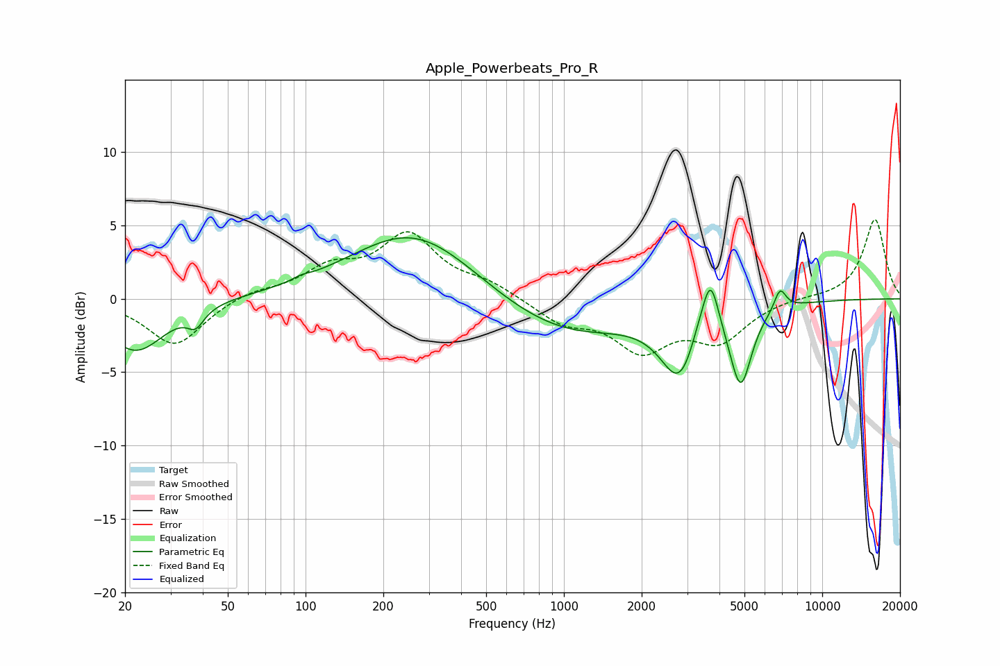

# Apple_Powerbeats_Pro_R
See [usage instructions](https://github.com/jaakkopasanen/AutoEq#usage) for more options and info.

### Parametric EQs
Apply preamp of -4.3 dB when using parametric equalizer.

|   # | Type    |   Fc (Hz) |    Q |   Gain (dB) |
|-----|---------|-----------|------|-------------|
|   1 | Peaking |        22 | 1.24 |        -3.6 |
|   2 | Peaking |        38 | 4.49 |        -1.1 |
|   3 | Peaking |        96 | 4.53 |         0.2 |
|   4 | Peaking |       264 | 0.58 |         4.8 |
|   5 | Peaking |       985 | 0.51 |        -2.7 |
|   6 | Peaking |      2820 | 1.93 |        -4.8 |
|   7 | Peaking |      3310 | 3.47 |         1.1 |
|   8 | Peaking |      3695 | 4.37 |         3.8 |
|   9 | Peaking |      4834 | 3.34 |        -5.3 |
|  10 | Peaking |      6867 | 5.9  |         1.5 |

### Fixed Band EQs
When using fixed band (also called graphic) equalizer, apply preamp of **-5.5 dB** (if available) and set gains manually with these parameters.

|   # | Type    |   Fc (Hz) |    Q |   Gain (dB) |
|-----|---------|-----------|------|-------------|
|   1 | Peaking |        31 | 1.41 |        -3.2 |
|   2 | Peaking |        62 | 1.41 |         0.5 |
|   3 | Peaking |       125 | 1.41 |         1.8 |
|   4 | Peaking |       250 | 1.41 |         4.1 |
|   5 | Peaking |       500 | 1.41 |         0.9 |
|   6 | Peaking |      1000 | 1.41 |        -1.5 |
|   7 | Peaking |      2000 | 1.41 |        -3.2 |
|   8 | Peaking |      4000 | 1.41 |        -2.6 |
|   9 | Peaking |      8000 | 1.41 |         0.1 |
|  10 | Peaking |     16000 | 1.41 |         5.4 |

### Graphs

