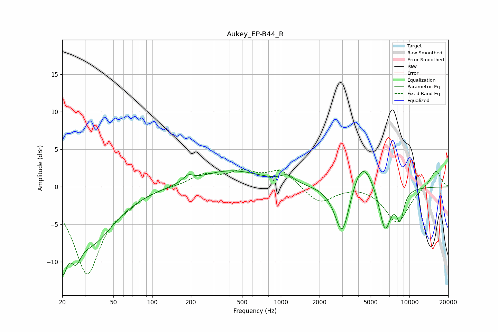

# Aukey_EP-B44_R
See [usage instructions](https://github.com/jaakkopasanen/AutoEq#usage) for more options and info.

### Parametric EQs
Apply preamp of -2.2 dB when using parametric equalizer.

|   # | Type    |   Fc (Hz) |    Q |   Gain (dB) |
|-----|---------|-----------|------|-------------|
|   1 | Peaking |        20 | 4.13 |        -6.7 |
|   2 | Peaking |        25 | 3.53 |        -3.2 |
|   3 | Peaking |        34 | 0.78 |        -7   |
|   4 | Peaking |       190 | 3.68 |         0.8 |
|   5 | Peaking |       405 | 0.57 |         2.2 |
|   6 | Peaking |      1127 | 2.82 |         1   |
|   7 | Peaking |      3004 | 2.44 |        -7.1 |
|   8 | Peaking |      4304 | 1.71 |         4.4 |
|   9 | Peaking |      6455 | 2.91 |        -6   |
|  10 | Peaking |      8454 | 4.38 |        -3.7 |

### Fixed Band EQs
When using fixed band (also called graphic) equalizer, apply preamp of **-2.4 dB** (if available) and set gains manually with these parameters.

|   # | Type    |   Fc (Hz) |    Q |   Gain (dB) |
|-----|---------|-----------|------|-------------|
|   1 | Peaking |        31 | 1.41 |       -11.4 |
|   2 | Peaking |        62 | 1.41 |        -1.2 |
|   3 | Peaking |       125 | 1.41 |         0.1 |
|   4 | Peaking |       250 | 1.41 |         1.5 |
|   5 | Peaking |       500 | 1.41 |         1.7 |
|   6 | Peaking |      1000 | 1.41 |         2.2 |
|   7 | Peaking |      2000 | 1.41 |        -2.3 |
|   8 | Peaking |      4000 | 1.41 |         0.3 |
|   9 | Peaking |      8000 | 1.41 |        -4.8 |
|  10 | Peaking |     16000 | 1.41 |         2.3 |

### Graphs

