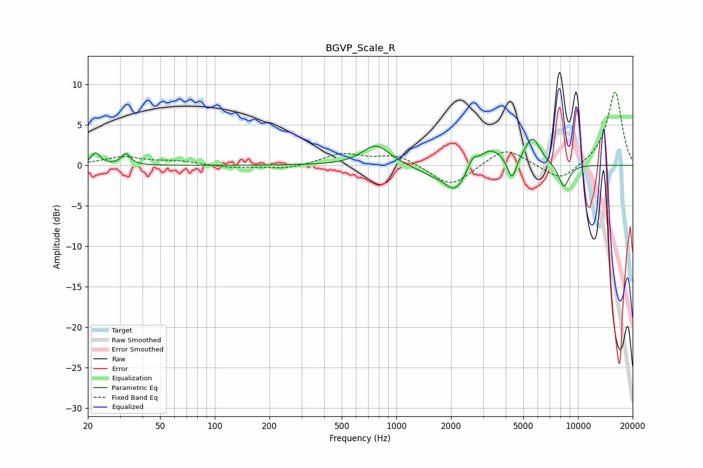

# BGVP_Scale_R
See [usage instructions](https://github.com/jaakkopasanen/AutoEq#usage) for more options and info.

### Parametric EQs
Apply preamp of -3.3 dB when using parametric equalizer.

|   # | Type    |   Fc (Hz) |    Q |   Gain (dB) |
|-----|---------|-----------|------|-------------|
|   1 | Peaking |        22 | 5.93 |         1.5 |
|   2 | Peaking |        32 | 5.96 |         1.4 |
|   3 | Peaking |       771 | 1.91 |         2.6 |
|   4 | Peaking |      1557 | 1.61 |        -0.9 |
|   5 | Peaking |      2107 | 2.4  |        -3.1 |
|   6 | Peaking |      2626 | 6    |         1.2 |
|   7 | Peaking |      3285 | 2.06 |         2.2 |
|   8 | Peaking |      4324 | 5.98 |        -2.8 |
|   9 | Peaking |      5612 | 3.17 |         3.4 |
|  10 | Peaking |      8360 | 4.41 |        -2.9 |

### Fixed Band EQs
When using fixed band (also called graphic) equalizer, apply preamp of **-9.1 dB** (if available) and set gains manually with these parameters.

|   # | Type    |   Fc (Hz) |    Q |   Gain (dB) |
|-----|---------|-----------|------|-------------|
|   1 | Peaking |        31 | 1.41 |         1   |
|   2 | Peaking |        62 | 1.41 |         0.5 |
|   3 | Peaking |       125 | 1.41 |        -0.3 |
|   4 | Peaking |       250 | 1.41 |        -0.5 |
|   5 | Peaking |       500 | 1.41 |         1.4 |
|   6 | Peaking |      1000 | 1.41 |         1.3 |
|   7 | Peaking |      2000 | 1.41 |        -2.7 |
|   8 | Peaking |      4000 | 1.41 |         2.3 |
|   9 | Peaking |      8000 | 1.41 |        -2.1 |
|  10 | Peaking |     16000 | 1.41 |         9.2 |

### Graphs

