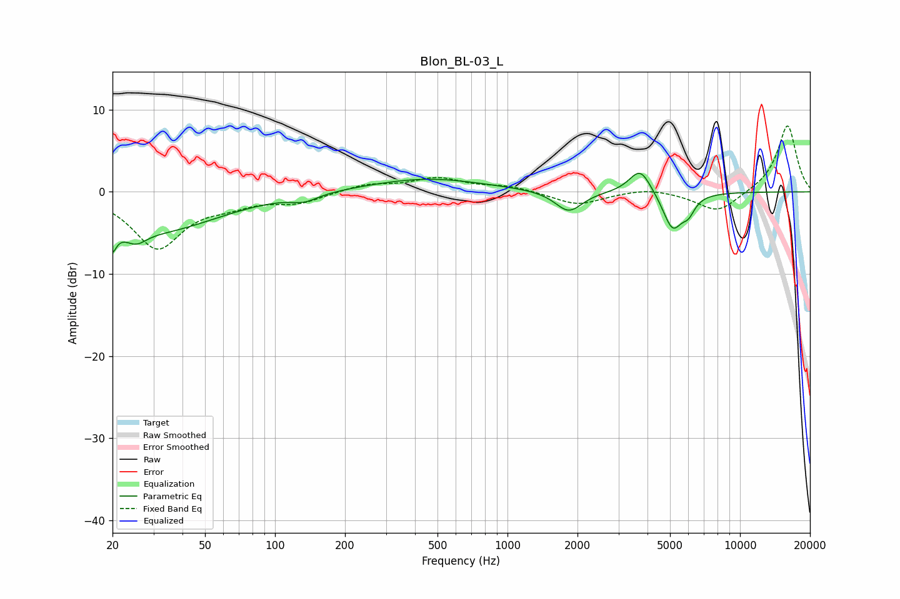

# Blon_BL-03_L
See [usage instructions](https://github.com/jaakkopasanen/AutoEq#usage) for more options and info.

### Parametric EQs
Apply preamp of -2.4 dB when using parametric equalizer.

|   # | Type    |   Fc (Hz) |    Q |   Gain (dB) |
|-----|---------|-----------|------|-------------|
|   1 | Peaking |        20 | 5.77 |        -5.5 |
|   2 | Peaking |        20 | 6    |         2.4 |
|   3 | Peaking |        25 | 3.05 |        -1.7 |
|   4 | Peaking |        31 | 0.54 |        -4.6 |
|   5 | Peaking |       134 | 2.51 |        -0.8 |
|   6 | Peaking |       449 | 0.57 |         1.6 |
|   7 | Peaking |      1835 | 2.43 |        -2.6 |
|   8 | Peaking |      3722 | 2.98 |         3.1 |
|   9 | Peaking |      5132 | 3.27 |        -4.6 |
|  10 | Peaking |      6007 | 5.05 |        -1.6 |

### Fixed Band EQs
When using fixed band (also called graphic) equalizer, apply preamp of **-8.1 dB** (if available) and set gains manually with these parameters.

|   # | Type    |   Fc (Hz) |    Q |   Gain (dB) |
|-----|---------|-----------|------|-------------|
|   1 | Peaking |        31 | 1.41 |        -6.7 |
|   2 | Peaking |        62 | 1.41 |        -1.1 |
|   3 | Peaking |       125 | 1.41 |        -1.2 |
|   4 | Peaking |       250 | 1.41 |         0.9 |
|   5 | Peaking |       500 | 1.41 |         1.6 |
|   6 | Peaking |      1000 | 1.41 |         0.7 |
|   7 | Peaking |      2000 | 1.41 |        -1.6 |
|   8 | Peaking |      4000 | 1.41 |         0.5 |
|   9 | Peaking |      8000 | 1.41 |        -2.6 |
|  10 | Peaking |     16000 | 1.41 |         8.2 |

### Graphs

