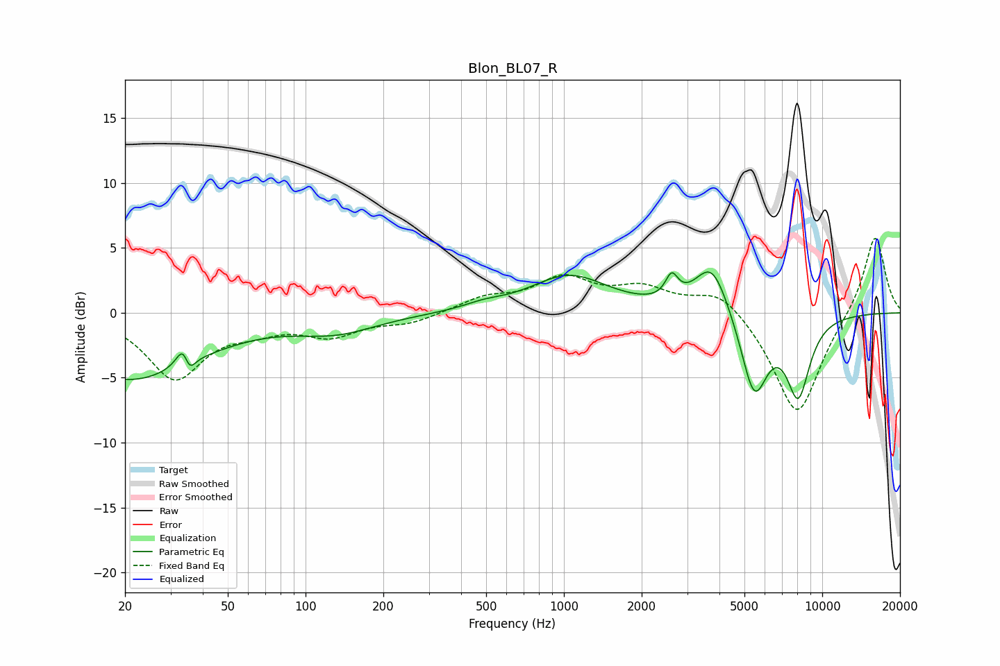

# Blon_BL07_R
See [usage instructions](https://github.com/jaakkopasanen/AutoEq#usage) for more options and info.

### Parametric EQs
Apply preamp of -3.2 dB when using parametric equalizer.

|   # | Type    |   Fc (Hz) |    Q |   Gain (dB) |
|-----|---------|-----------|------|-------------|
|   1 | Peaking |        21 | 0.52 |        -5.1 |
|   2 | Peaking |        34 | 5.46 |         3.5 |
|   3 | Peaking |        35 | 6    |        -3.1 |
|   4 | Peaking |       131 | 0.89 |        -1.3 |
|   5 | Peaking |       489 | 1.9  |         0.4 |
|   6 | Peaking |      1049 | 0.94 |         2.8 |
|   7 | Peaking |      2614 | 5.91 |         1.8 |
|   8 | Peaking |      3737 | 2.13 |         4   |
|   9 | Peaking |      5455 | 2.64 |        -6.3 |
|  10 | Peaking |      8071 | 2.87 |        -6   |

### Fixed Band EQs
When using fixed band (also called graphic) equalizer, apply preamp of **-5.8 dB** (if available) and set gains manually with these parameters.

|   # | Type    |   Fc (Hz) |    Q |   Gain (dB) |
|-----|---------|-----------|------|-------------|
|   1 | Peaking |        31 | 1.41 |        -4.9 |
|   2 | Peaking |        62 | 1.41 |        -0.9 |
|   3 | Peaking |       125 | 1.41 |        -1.6 |
|   4 | Peaking |       250 | 1.41 |        -0.7 |
|   5 | Peaking |       500 | 1.41 |         1.1 |
|   6 | Peaking |      1000 | 1.41 |         2.5 |
|   7 | Peaking |      2000 | 1.41 |         1.7 |
|   8 | Peaking |      4000 | 1.41 |         1.9 |
|   9 | Peaking |      8000 | 1.41 |        -8.1 |
|  10 | Peaking |     16000 | 1.41 |         6.2 |

### Graphs

