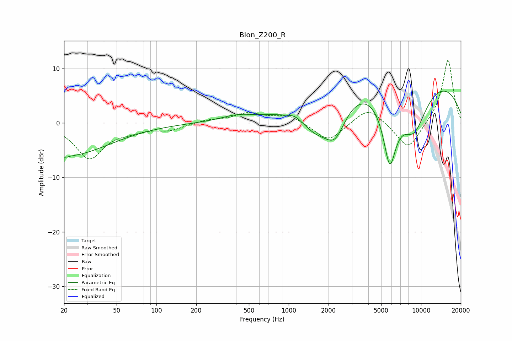

# Blon_Z200_R
See [usage instructions](https://github.com/jaakkopasanen/AutoEq#usage) for more options and info.

### Parametric EQs
Apply preamp of -6.0 dB when using parametric equalizer.

|   # | Type    |   Fc (Hz) |    Q |   Gain (dB) |
|-----|---------|-----------|------|-------------|
|   1 | Peaking |        20 | 0.42 |        -6.1 |
|   2 | Peaking |        20 | 4.73 |         3.6 |
|   3 | Peaking |        20 | 4.88 |        -3.8 |
|   4 | Peaking |       403 | 1.15 |         1   |
|   5 | Peaking |      1114 | 3.4  |         0.6 |
|   6 | Peaking |      1602 | 1.22 |        -4.8 |
|   7 | Peaking |      2240 | 1.65 |        -6.9 |
|   8 | Peaking |      5806 | 2.44 |       -13.1 |
|   9 | Peaking |      6945 | 0.18 |        10.5 |
|  10 | Peaking |      8826 | 1.14 |        -9.8 |

### Fixed Band EQs
When using fixed band (also called graphic) equalizer, apply preamp of **-11.6 dB** (if available) and set gains manually with these parameters.

|   # | Type    |   Fc (Hz) |    Q |   Gain (dB) |
|-----|---------|-----------|------|-------------|
|   1 | Peaking |        31 | 1.41 |        -6.4 |
|   2 | Peaking |        62 | 1.41 |        -1   |
|   3 | Peaking |       125 | 1.41 |        -1.2 |
|   4 | Peaking |       250 | 1.41 |         0.6 |
|   5 | Peaking |       500 | 1.41 |         1.7 |
|   6 | Peaking |      1000 | 1.41 |         1.5 |
|   7 | Peaking |      2000 | 1.41 |        -3.5 |
|   8 | Peaking |      4000 | 1.41 |         3.1 |
|   9 | Peaking |      8000 | 1.41 |        -5.1 |
|  10 | Peaking |     16000 | 1.41 |        11.9 |

### Graphs

