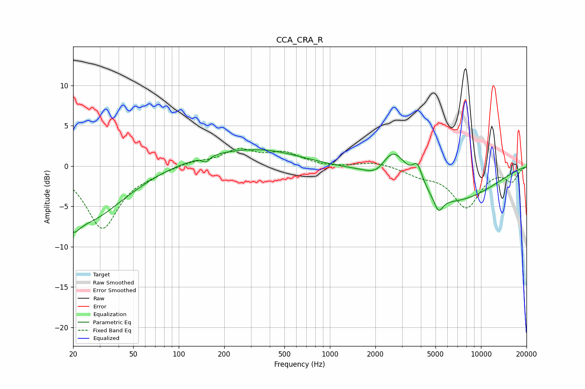

# CCA_CRA_R
See [usage instructions](https://github.com/jaakkopasanen/AutoEq#usage) for more options and info.

### Parametric EQs
Apply preamp of -2.1 dB when using parametric equalizer.

|   # | Type    |   Fc (Hz) |    Q |   Gain (dB) |
|-----|---------|-----------|------|-------------|
|   1 | Peaking |        20 | 3.58 |        -1.8 |
|   2 | Peaking |        24 | 0.57 |        -6.8 |
|   3 | Peaking |       151 | 5.97 |        -0.7 |
|   4 | Peaking |       230 | 0.41 |         1.8 |
|   5 | Peaking |       428 | 0.71 |         0.6 |
|   6 | Peaking |      2055 | 2.14 |        -1.2 |
|   7 | Peaking |      2638 | 1.61 |         4.4 |
|   8 | Peaking |      3798 | 4.31 |         2.5 |
|   9 | Peaking |      5238 | 4.89 |        -1.8 |
|  10 | Peaking |      5977 | 0.43 |        -4.6 |

### Fixed Band EQs
When using fixed band (also called graphic) equalizer, apply preamp of **-2.2 dB** (if available) and set gains manually with these parameters.

|   # | Type    |   Fc (Hz) |    Q |   Gain (dB) |
|-----|---------|-----------|------|-------------|
|   1 | Peaking |        31 | 1.41 |        -7.7 |
|   2 | Peaking |        62 | 1.41 |        -0.6 |
|   3 | Peaking |       125 | 1.41 |         0.5 |
|   4 | Peaking |       250 | 1.41 |         1.9 |
|   5 | Peaking |       500 | 1.41 |         1.5 |
|   6 | Peaking |      1000 | 1.41 |        -0.2 |
|   7 | Peaking |      2000 | 1.41 |         0.6 |
|   8 | Peaking |      4000 | 1.41 |        -0.9 |
|   9 | Peaking |      8000 | 1.41 |        -5   |
|  10 | Peaking |     16000 | 1.41 |        -1.8 |

### Graphs

