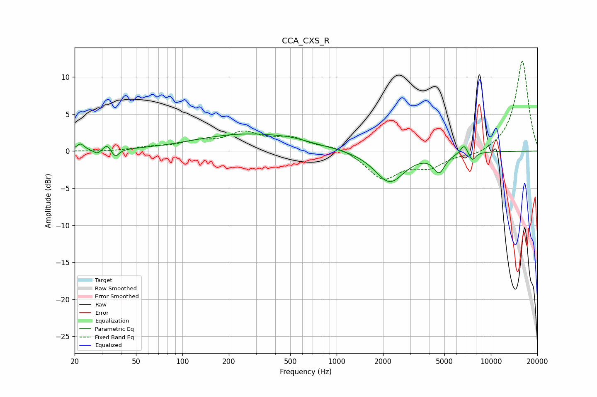

# CCA_CXS_R
See [usage instructions](https://github.com/jaakkopasanen/AutoEq#usage) for more options and info.

### Parametric EQs
Apply preamp of -2.4 dB when using parametric equalizer.

|   # | Type    |   Fc (Hz) |    Q |   Gain (dB) |
|-----|---------|-----------|------|-------------|
|   1 | Peaking |        22 | 5.99 |         0.9 |
|   2 | Peaking |        28 | 6    |        -0.6 |
|   3 | Peaking |        32 | 6    |         0.9 |
|   4 | Peaking |        37 | 6    |        -1.1 |
|   5 | Peaking |       264 | 0.41 |         2.3 |
|   6 | Peaking |       502 | 1.44 |         0.3 |
|   7 | Peaking |      2205 | 1.48 |        -4.2 |
|   8 | Peaking |      4625 | 3.84 |        -2.4 |
|   9 | Peaking |      6700 | 5.97 |         1.3 |
|  10 | Peaking |      7574 | 6    |        -1.2 |

### Fixed Band EQs
When using fixed band (also called graphic) equalizer, apply preamp of **-12.2 dB** (if available) and set gains manually with these parameters.

|   # | Type    |   Fc (Hz) |    Q |   Gain (dB) |
|-----|---------|-----------|------|-------------|
|   1 | Peaking |        31 | 1.41 |        -0.1 |
|   2 | Peaking |        62 | 1.41 |         0.4 |
|   3 | Peaking |       125 | 1.41 |         1.1 |
|   4 | Peaking |       250 | 1.41 |         2.2 |
|   5 | Peaking |       500 | 1.41 |         1.6 |
|   6 | Peaking |      1000 | 1.41 |         0.7 |
|   7 | Peaking |      2000 | 1.41 |        -3.7 |
|   8 | Peaking |      4000 | 1.41 |        -1.9 |
|   9 | Peaking |      8000 | 1.41 |        -0.7 |
|  10 | Peaking |     16000 | 1.41 |        12.3 |

### Graphs

