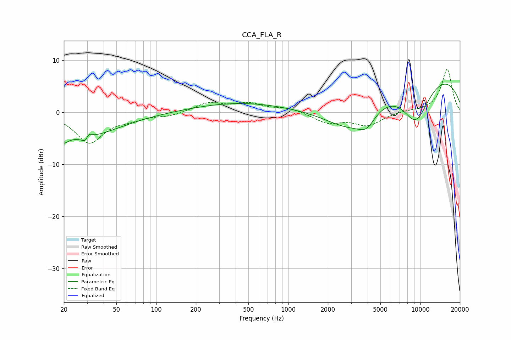

# CCA_FLA_R
See [usage instructions](https://github.com/jaakkopasanen/AutoEq#usage) for more options and info.

### Parametric EQs
Apply preamp of -5.5 dB when using parametric equalizer.

|   # | Type    |   Fc (Hz) |    Q |   Gain (dB) |
|-----|---------|-----------|------|-------------|
|   1 | Peaking |        20 | 5.79 |        -0.9 |
|   2 | Peaking |        24 | 0.46 |        -5.1 |
|   3 | Peaking |        24 | 5.99 |         0.1 |
|   4 | Peaking |        30 | 5.84 |        -3.3 |
|   5 | Peaking |        30 | 5.7  |         3.3 |
|   6 | Peaking |      1064 | 0.2  |         2.9 |
|   7 | Peaking |      3073 | 0.45 |       -13.8 |
|   8 | Peaking |      3925 | 2.24 |        -2.5 |
|   9 | Peaking |      7446 | 0.26 |        15.9 |
|  10 | Peaking |      9227 | 0.9  |       -12.3 |

### Fixed Band EQs
When using fixed band (also called graphic) equalizer, apply preamp of **-8.4 dB** (if available) and set gains manually with these parameters.

|   # | Type    |   Fc (Hz) |    Q |   Gain (dB) |
|-----|---------|-----------|------|-------------|
|   1 | Peaking |        31 | 1.41 |        -5.7 |
|   2 | Peaking |        62 | 1.41 |        -1   |
|   3 | Peaking |       125 | 1.41 |        -0.6 |
|   4 | Peaking |       250 | 1.41 |         1.8 |
|   5 | Peaking |       500 | 1.41 |         1.6 |
|   6 | Peaking |      1000 | 1.41 |         0.8 |
|   7 | Peaking |      2000 | 1.41 |        -1.9 |
|   8 | Peaking |      4000 | 1.41 |        -2.4 |
|   9 | Peaking |      8000 | 1.41 |         0.3 |
|  10 | Peaking |     16000 | 1.41 |         8.3 |

### Graphs

