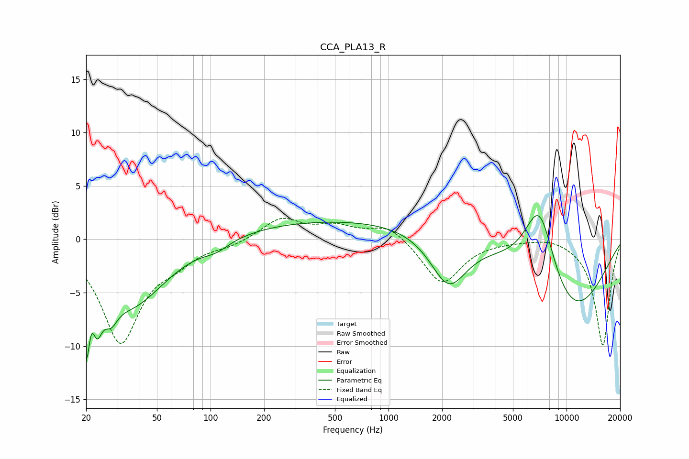

# CCA_PLA13_R
See [usage instructions](https://github.com/jaakkopasanen/AutoEq#usage) for more options and info.

### Parametric EQs
Apply preamp of -2.3 dB when using parametric equalizer.

|   # | Type    |   Fc (Hz) |    Q |   Gain (dB) |
|-----|---------|-----------|------|-------------|
|   1 | Peaking |        20 | 5.91 |        -8   |
|   2 | Peaking |        21 | 5.81 |         3   |
|   3 | Peaking |        23 | 4.57 |        -4.2 |
|   4 | Peaking |        28 | 3.88 |        -1.9 |
|   5 | Peaking |        36 | 0.73 |        -6   |
|   6 | Peaking |       108 | 1.94 |        -0.7 |
|   7 | Peaking |       716 | 0.18 |         1.9 |
|   8 | Peaking |      2175 | 1.37 |        -5   |
|   9 | Peaking |      7049 | 1.46 |         8.3 |
|  10 | Peaking |     10000 | 0.51 |        -7.9 |

### Fixed Band EQs
When using fixed band (also called graphic) equalizer, apply preamp of **-2.1 dB** (if available) and set gains manually with these parameters.

|   # | Type    |   Fc (Hz) |    Q |   Gain (dB) |
|-----|---------|-----------|------|-------------|
|   1 | Peaking |        31 | 1.41 |        -9.5 |
|   2 | Peaking |        62 | 1.41 |        -1.5 |
|   3 | Peaking |       125 | 1.41 |        -0.5 |
|   4 | Peaking |       250 | 1.41 |         2   |
|   5 | Peaking |       500 | 1.41 |         1.1 |
|   6 | Peaking |      1000 | 1.41 |         1.4 |
|   7 | Peaking |      2000 | 1.41 |        -4.2 |
|   8 | Peaking |      4000 | 1.41 |        -0.1 |
|   9 | Peaking |      8000 | 1.41 |         0.4 |
|  10 | Peaking |     16000 | 1.41 |       -10   |

### Graphs

