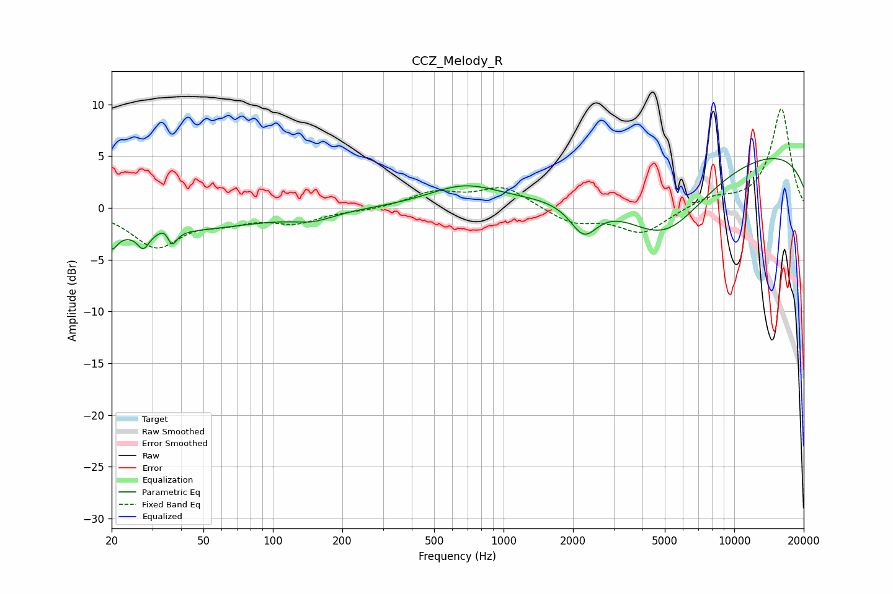

# CCZ_Melody_R
See [usage instructions](https://github.com/jaakkopasanen/AutoEq#usage) for more options and info.

### Parametric EQs
Apply preamp of -4.9 dB when using parametric equalizer.

|   # | Type    |   Fc (Hz) |    Q |   Gain (dB) |
|-----|---------|-----------|------|-------------|
|   1 | Peaking |        20 | 5.88 |        -1.5 |
|   2 | Peaking |        24 | 0.26 |        -2.4 |
|   3 | Peaking |        27 | 5.8  |        -1.5 |
|   4 | Peaking |        35 | 4.79 |         2.2 |
|   5 | Peaking |        36 | 5.94 |        -3   |
|   6 | Peaking |       150 | 1.63 |        -0.8 |
|   7 | Peaking |       673 | 0.93 |         2   |
|   8 | Peaking |      2228 | 2.34 |        -3.2 |
|   9 | Peaking |      4959 | 0.71 |        -7.2 |
|  10 | Peaking |      9993 | 0.18 |         5.9 |

### Fixed Band EQs
When using fixed band (also called graphic) equalizer, apply preamp of **-9.7 dB** (if available) and set gains manually with these parameters.

|   # | Type    |   Fc (Hz) |    Q |   Gain (dB) |
|-----|---------|-----------|------|-------------|
|   1 | Peaking |        31 | 1.41 |        -3.6 |
|   2 | Peaking |        62 | 1.41 |        -1   |
|   3 | Peaking |       125 | 1.41 |        -1.3 |
|   4 | Peaking |       250 | 1.41 |        -0.2 |
|   5 | Peaking |       500 | 1.41 |         1.4 |
|   6 | Peaking |      1000 | 1.41 |         2   |
|   7 | Peaking |      2000 | 1.41 |        -1.5 |
|   8 | Peaking |      4000 | 1.41 |        -2.4 |
|   9 | Peaking |      8000 | 1.41 |         0.9 |
|  10 | Peaking |     16000 | 1.41 |         9.6 |

### Graphs

