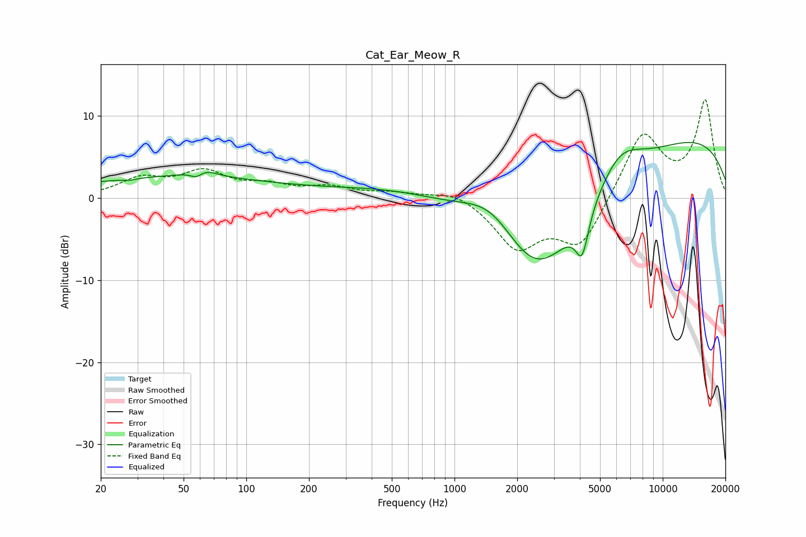

# Cat_Ear_Meow_R
See [usage instructions](https://github.com/jaakkopasanen/AutoEq#usage) for more options and info.

### Parametric EQs
Apply preamp of -6.9 dB when using parametric equalizer.

|   # | Type    |   Fc (Hz) |    Q |   Gain (dB) |
|-----|---------|-----------|------|-------------|
|   1 | Peaking |        28 | 4.46 |        -0.2 |
|   2 | Peaking |        45 | 0.28 |         2.5 |
|   3 | Peaking |        58 | 3.76 |        -2   |
|   4 | Peaking |        59 | 2.6  |         2.2 |
|   5 | Peaking |       806 | 0.4  |         4   |
|   6 | Peaking |      1519 | 0.95 |         5.2 |
|   7 | Peaking |      2439 | 0.45 |       -17.3 |
|   8 | Peaking |      4102 | 4.5  |        -5   |
|   9 | Peaking |      6178 | 1.22 |         4.5 |
|  10 | Peaking |      9204 | 0.2  |         8.9 |

### Fixed Band EQs
When using fixed band (also called graphic) equalizer, apply preamp of **-12.0 dB** (if available) and set gains manually with these parameters.

|   # | Type    |   Fc (Hz) |    Q |   Gain (dB) |
|-----|---------|-----------|------|-------------|
|   1 | Peaking |        31 | 1.41 |         2.1 |
|   2 | Peaking |        62 | 1.41 |         2.9 |
|   3 | Peaking |       125 | 1.41 |         1.3 |
|   4 | Peaking |       250 | 1.41 |         1.2 |
|   5 | Peaking |       500 | 1.41 |         0.6 |
|   6 | Peaking |      1000 | 1.41 |         1.1 |
|   7 | Peaking |      2000 | 1.41 |        -5.8 |
|   8 | Peaking |      4000 | 1.41 |        -5.9 |
|   9 | Peaking |      8000 | 1.41 |         8   |
|  10 | Peaking |     16000 | 1.41 |        11.7 |

### Graphs

