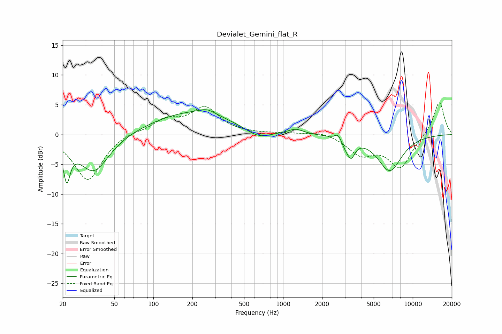

# Devialet_Gemini_flat_R
See [usage instructions](https://github.com/jaakkopasanen/AutoEq#usage) for more options and info.

### Parametric EQs
Apply preamp of -4.3 dB when using parametric equalizer.

|   # | Type    |   Fc (Hz) |    Q |   Gain (dB) |
|-----|---------|-----------|------|-------------|
|   1 | Peaking |        21 | 5.56 |        -5.8 |
|   2 | Peaking |        35 | 1.21 |        -6.4 |
|   3 | Peaking |       198 | 0.44 |         3.8 |
|   4 | Peaking |       260 | 2.23 |         0.8 |
|   5 | Peaking |       643 | 1.44 |        -1.6 |
|   6 | Peaking |      1255 | 2.48 |         0.8 |
|   7 | Peaking |      2666 | 5.43 |         1.2 |
|   8 | Peaking |      3074 | 3.48 |        -1.6 |
|   9 | Peaking |      3367 | 5.12 |        -2.2 |
|  10 | Peaking |      6637 | 1.46 |        -6   |

### Fixed Band EQs
When using fixed band (also called graphic) equalizer, apply preamp of **-5.4 dB** (if available) and set gains manually with these parameters.

|   # | Type    |   Fc (Hz) |    Q |   Gain (dB) |
|-----|---------|-----------|------|-------------|
|   1 | Peaking |        31 | 1.41 |        -7.8 |
|   2 | Peaking |        62 | 1.41 |         0.6 |
|   3 | Peaking |       125 | 1.41 |         2.3 |
|   4 | Peaking |       250 | 1.41 |         4.3 |
|   5 | Peaking |       500 | 1.41 |         0.1 |
|   6 | Peaking |      1000 | 1.41 |         0.2 |
|   7 | Peaking |      2000 | 1.41 |         0.6 |
|   8 | Peaking |      4000 | 1.41 |        -3.1 |
|   9 | Peaking |      8000 | 1.41 |        -5.4 |
|  10 | Peaking |     16000 | 1.41 |         5.7 |

### Graphs

