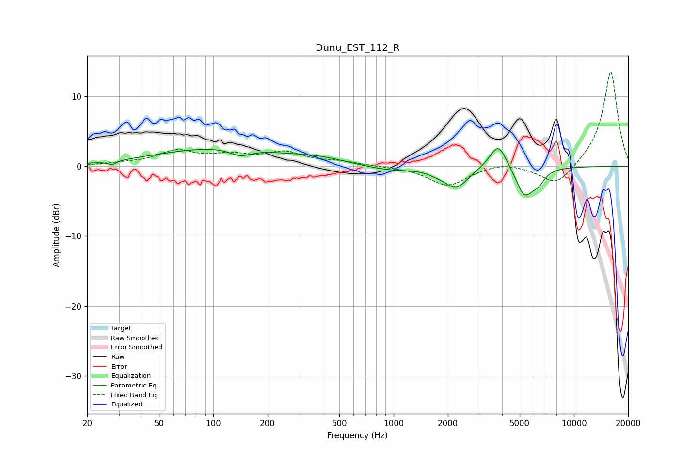

# Dunu_EST_112_R
See [usage instructions](https://github.com/jaakkopasanen/AutoEq#usage) for more options and info.

### Parametric EQs
Apply preamp of -2.6 dB when using parametric equalizer.

|   # | Type    |   Fc (Hz) |    Q |   Gain (dB) |
|-----|---------|-----------|------|-------------|
|   1 | Peaking |        27 | 6    |        -0.5 |
|   2 | Peaking |       110 | 0.4  |         2.6 |
|   3 | Peaking |       142 | 2.4  |        -1.1 |
|   4 | Peaking |       397 | 0.99 |         0.6 |
|   5 | Peaking |       938 | 1.01 |        -0.7 |
|   6 | Peaking |      1735 | 2.96 |        -0.4 |
|   7 | Peaking |      2225 | 2.21 |        -3   |
|   8 | Peaking |      3806 | 2.96 |         3.8 |
|   9 | Peaking |      5332 | 2.89 |        -4.2 |
|  10 | Peaking |      6362 | 4.15 |        -1.4 |

### Fixed Band EQs
When using fixed band (also called graphic) equalizer, apply preamp of **-13.6 dB** (if available) and set gains manually with these parameters.

|   # | Type    |   Fc (Hz) |    Q |   Gain (dB) |
|-----|---------|-----------|------|-------------|
|   1 | Peaking |        31 | 1.41 |         0.3 |
|   2 | Peaking |        62 | 1.41 |         2   |
|   3 | Peaking |       125 | 1.41 |         1.3 |
|   4 | Peaking |       250 | 1.41 |         1.8 |
|   5 | Peaking |       500 | 1.41 |         0.6 |
|   6 | Peaking |      1000 | 1.41 |        -0   |
|   7 | Peaking |      2000 | 1.41 |        -2.8 |
|   8 | Peaking |      4000 | 1.41 |         0.7 |
|   9 | Peaking |      8000 | 1.41 |        -3   |
|  10 | Peaking |     16000 | 1.41 |        13.8 |

### Graphs

