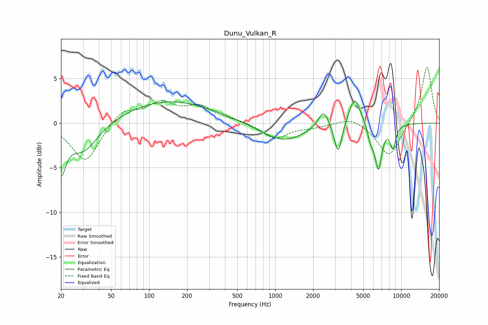

# Dunu_Vulkan_R
See [usage instructions](https://github.com/jaakkopasanen/AutoEq#usage) for more options and info.

### Parametric EQs
Apply preamp of -2.6 dB when using parametric equalizer.

|   # | Type    |   Fc (Hz) |    Q |   Gain (dB) |
|-----|---------|-----------|------|-------------|
|   1 | Peaking |        20 | 3.87 |        -4.6 |
|   2 | Peaking |        30 | 1.21 |        -3.4 |
|   3 | Peaking |       144 | 0.4  |         2.5 |
|   4 | Peaking |      1158 | 0.81 |        -2.1 |
|   5 | Peaking |      2415 | 3.37 |         2   |
|   6 | Peaking |      3156 | 4.73 |        -3.6 |
|   7 | Peaking |      4272 | 2.99 |         3.3 |
|   8 | Peaking |      5714 | 5.89 |        -1.5 |
|   9 | Peaking |      6584 | 4.82 |        -4.9 |
|  10 | Peaking |      8593 | 5.73 |        -2.5 |

### Fixed Band EQs
When using fixed band (also called graphic) equalizer, apply preamp of **-6.3 dB** (if available) and set gains manually with these parameters.

|   # | Type    |   Fc (Hz) |    Q |   Gain (dB) |
|-----|---------|-----------|------|-------------|
|   1 | Peaking |        31 | 1.41 |        -4.4 |
|   2 | Peaking |        62 | 1.41 |         1.6 |
|   3 | Peaking |       125 | 1.41 |         2.1 |
|   4 | Peaking |       250 | 1.41 |         1.7 |
|   5 | Peaking |       500 | 1.41 |         0.3 |
|   6 | Peaking |      1000 | 1.41 |        -1.7 |
|   7 | Peaking |      2000 | 1.41 |        -0.4 |
|   8 | Peaking |      4000 | 1.41 |         0.8 |
|   9 | Peaking |      8000 | 1.41 |        -3.9 |
|  10 | Peaking |     16000 | 1.41 |         6.5 |

### Graphs

