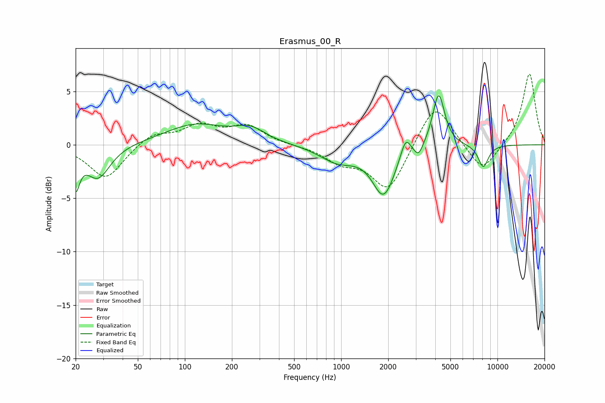

# Erasmus_00_R
See [usage instructions](https://github.com/jaakkopasanen/AutoEq#usage) for more options and info.

### Parametric EQs
Apply preamp of -4.7 dB when using parametric equalizer.

|   # | Type    |   Fc (Hz) |    Q |   Gain (dB) |
|-----|---------|-----------|------|-------------|
|   1 | Peaking |        20 | 5.71 |        -3.3 |
|   2 | Peaking |        28 | 1.83 |        -3.1 |
|   3 | Peaking |       117 | 0.73 |         1.9 |
|   4 | Peaking |       263 | 1.49 |         1.2 |
|   5 | Peaking |       949 | 1.23 |        -1.5 |
|   6 | Peaking |      1871 | 1.99 |        -4.6 |
|   7 | Peaking |      2585 | 4.42 |         1.9 |
|   8 | Peaking |      3130 | 5.06 |        -1.1 |
|   9 | Peaking |      4204 | 3.7  |         5   |
|  10 | Peaking |      8121 | 4    |        -2.1 |

### Fixed Band EQs
When using fixed band (also called graphic) equalizer, apply preamp of **-6.7 dB** (if available) and set gains manually with these parameters.

|   # | Type    |   Fc (Hz) |    Q |   Gain (dB) |
|-----|---------|-----------|------|-------------|
|   1 | Peaking |        31 | 1.41 |        -3.2 |
|   2 | Peaking |        62 | 1.41 |         1.1 |
|   3 | Peaking |       125 | 1.41 |         1.7 |
|   4 | Peaking |       250 | 1.41 |         1.7 |
|   5 | Peaking |       500 | 1.41 |        -0   |
|   6 | Peaking |      1000 | 1.41 |        -1.4 |
|   7 | Peaking |      2000 | 1.41 |        -4.3 |
|   8 | Peaking |      4000 | 1.41 |         4.2 |
|   9 | Peaking |      8000 | 1.41 |        -2.7 |
|  10 | Peaking |     16000 | 1.41 |         6.7 |

### Graphs

