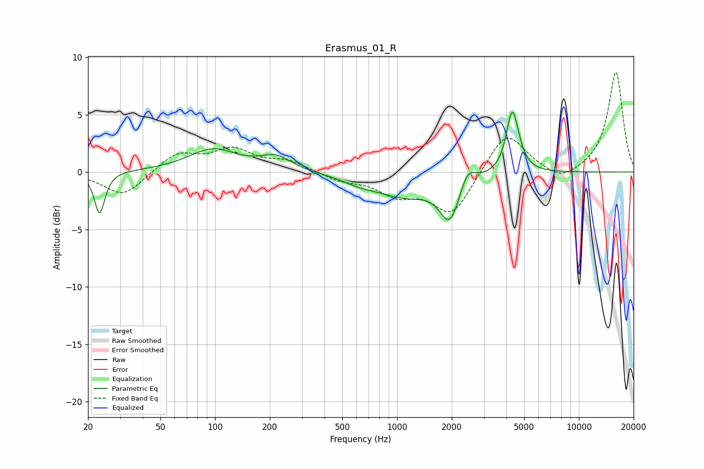

# Erasmus_01_R
See [usage instructions](https://github.com/jaakkopasanen/AutoEq#usage) for more options and info.

### Parametric EQs
Apply preamp of -5.3 dB when using parametric equalizer.

|   # | Type    |   Fc (Hz) |    Q |   Gain (dB) |
|-----|---------|-----------|------|-------------|
|   1 | Peaking |        23 | 5.12 |        -3.7 |
|   2 | Peaking |        97 | 1.03 |         1.9 |
|   3 | Peaking |       216 | 1.7  |         1.2 |
|   4 | Peaking |       625 | 1.41 |        -0.6 |
|   5 | Peaking |      1110 | 0.9  |        -1.9 |
|   6 | Peaking |      1953 | 2.57 |        -3.7 |
|   7 | Peaking |      2441 | 3.5  |         1.6 |
|   8 | Peaking |      4272 | 4.53 |         3.8 |
|   9 | Peaking |      4504 | 3.98 |         2.5 |
|  10 | Peaking |      4617 | 4.76 |        -0.8 |

### Fixed Band EQs
When using fixed band (also called graphic) equalizer, apply preamp of **-8.8 dB** (if available) and set gains manually with these parameters.

|   # | Type    |   Fc (Hz) |    Q |   Gain (dB) |
|-----|---------|-----------|------|-------------|
|   1 | Peaking |        31 | 1.41 |        -2.1 |
|   2 | Peaking |        62 | 1.41 |         1.6 |
|   3 | Peaking |       125 | 1.41 |         1.8 |
|   4 | Peaking |       250 | 1.41 |         0.9 |
|   5 | Peaking |       500 | 1.41 |        -0.7 |
|   6 | Peaking |      1000 | 1.41 |        -1.7 |
|   7 | Peaking |      2000 | 1.41 |        -3.7 |
|   8 | Peaking |      4000 | 1.41 |         3.7 |
|   9 | Peaking |      8000 | 1.41 |        -1   |
|  10 | Peaking |     16000 | 1.41 |         8.7 |

### Graphs

