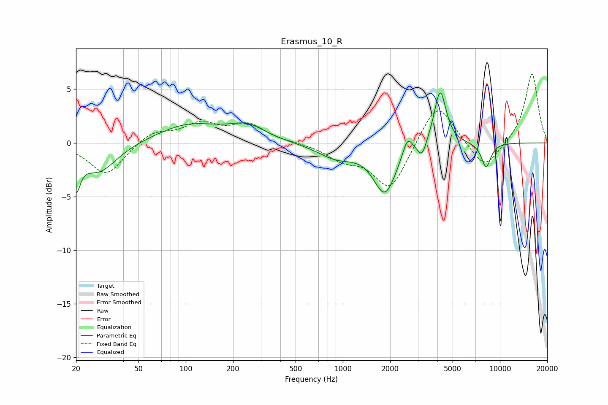

# Erasmus_10_R
See [usage instructions](https://github.com/jaakkopasanen/AutoEq#usage) for more options and info.

### Parametric EQs
Apply preamp of -4.8 dB when using parametric equalizer.

|   # | Type    |   Fc (Hz) |    Q |   Gain (dB) |
|-----|---------|-----------|------|-------------|
|   1 | Peaking |        20 | 5.41 |        -3.1 |
|   2 | Peaking |        28 | 1.23 |        -2.8 |
|   3 | Peaking |       105 | 0.69 |         1.7 |
|   4 | Peaking |       247 | 1.26 |         1.3 |
|   5 | Peaking |       912 | 1.18 |        -1.3 |
|   6 | Peaking |      1852 | 1.96 |        -4.5 |
|   7 | Peaking |      2581 | 4.51 |         1.7 |
|   8 | Peaking |      3192 | 5.07 |        -1.4 |
|   9 | Peaking |      4163 | 3.69 |         5.2 |
|  10 | Peaking |      8168 | 4.29 |        -2.3 |

### Fixed Band EQs
When using fixed band (also called graphic) equalizer, apply preamp of **-6.5 dB** (if available) and set gains manually with these parameters.

|   # | Type    |   Fc (Hz) |    Q |   Gain (dB) |
|-----|---------|-----------|------|-------------|
|   1 | Peaking |        31 | 1.41 |        -3   |
|   2 | Peaking |        62 | 1.41 |         1.1 |
|   3 | Peaking |       125 | 1.41 |         1.6 |
|   4 | Peaking |       250 | 1.41 |         1.6 |
|   5 | Peaking |       500 | 1.41 |         0   |
|   6 | Peaking |      1000 | 1.41 |        -1.3 |
|   7 | Peaking |      2000 | 1.41 |        -4.4 |
|   8 | Peaking |      4000 | 1.41 |         4.1 |
|   9 | Peaking |      8000 | 1.41 |        -2.6 |
|  10 | Peaking |     16000 | 1.41 |         6.5 |

### Graphs

