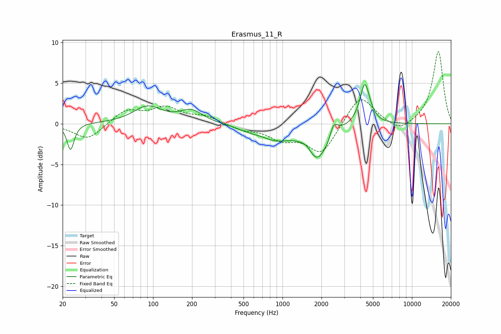

# Erasmus_11_R
See [usage instructions](https://github.com/jaakkopasanen/AutoEq#usage) for more options and info.

### Parametric EQs
Apply preamp of -4.9 dB when using parametric equalizer.

|   # | Type    |   Fc (Hz) |    Q |   Gain (dB) |
|-----|---------|-----------|------|-------------|
|   1 | Peaking |        23 | 5.31 |        -3.2 |
|   2 | Peaking |        91 | 1.29 |         2.1 |
|   3 | Peaking |       198 | 1.64 |         1.5 |
|   4 | Peaking |       537 | 1.68 |        -0.4 |
|   5 | Peaking |       890 | 1.14 |        -1.7 |
|   6 | Peaking |      1549 | 3.37 |         0.6 |
|   7 | Peaking |      1849 | 1.81 |        -4.2 |
|   8 | Peaking |      2315 | 4.59 |        -0.9 |
|   9 | Peaking |      2454 | 4.32 |         2.2 |
|  10 | Peaking |      4328 | 3.64 |         5.1 |

### Fixed Band EQs
When using fixed band (also called graphic) equalizer, apply preamp of **-9.0 dB** (if available) and set gains manually with these parameters.

|   # | Type    |   Fc (Hz) |    Q |   Gain (dB) |
|-----|---------|-----------|------|-------------|
|   1 | Peaking |        31 | 1.41 |        -2   |
|   2 | Peaking |        62 | 1.41 |         1.7 |
|   3 | Peaking |       125 | 1.41 |         1.8 |
|   4 | Peaking |       250 | 1.41 |         0.9 |
|   5 | Peaking |       500 | 1.41 |        -0.7 |
|   6 | Peaking |      1000 | 1.41 |        -1.7 |
|   7 | Peaking |      2000 | 1.41 |        -3.7 |
|   8 | Peaking |      4000 | 1.41 |         3.7 |
|   9 | Peaking |      8000 | 1.41 |        -1.2 |
|  10 | Peaking |     16000 | 1.41 |         9   |

### Graphs

