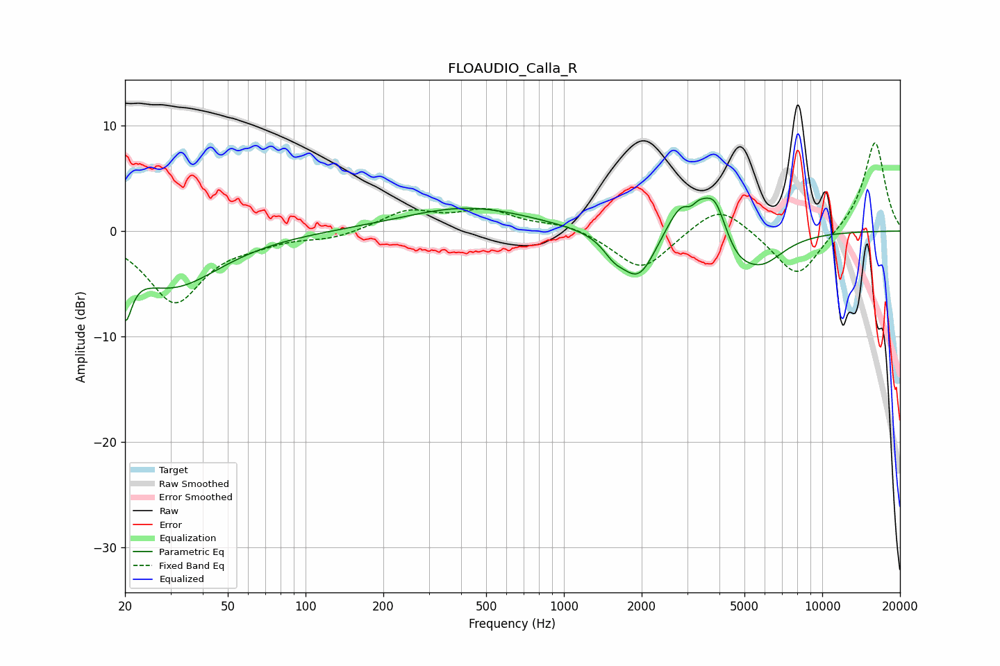

# FLOAUDIO_Calla_R
See [usage instructions](https://github.com/jaakkopasanen/AutoEq#usage) for more options and info.

### Parametric EQs
Apply preamp of -3.2 dB when using parametric equalizer.

|   # | Type    |   Fc (Hz) |    Q |   Gain (dB) |
|-----|---------|-----------|------|-------------|
|   1 | Peaking |        20 | 5.59 |        -4.9 |
|   2 | Peaking |        30 | 0.76 |        -5.2 |
|   3 | Peaking |       424 | 0.57 |         2.3 |
|   4 | Peaking |      1557 | 3.54 |        -1.1 |
|   5 | Peaking |      1948 | 1.93 |        -5   |
|   6 | Peaking |      3061 | 1.91 |         5.1 |
|   7 | Peaking |      3089 | 5.3  |        -1.6 |
|   8 | Peaking |      3865 | 3.64 |         2.6 |
|   9 | Peaking |      4680 | 2.45 |        -1.7 |
|  10 | Peaking |      5782 | 1.52 |        -3.1 |

### Fixed Band EQs
When using fixed band (also called graphic) equalizer, apply preamp of **-8.5 dB** (if available) and set gains manually with these parameters.

|   # | Type    |   Fc (Hz) |    Q |   Gain (dB) |
|-----|---------|-----------|------|-------------|
|   1 | Peaking |        31 | 1.41 |        -6.7 |
|   2 | Peaking |        62 | 1.41 |        -0.7 |
|   3 | Peaking |       125 | 1.41 |        -0.7 |
|   4 | Peaking |       250 | 1.41 |         1.9 |
|   5 | Peaking |       500 | 1.41 |         1.8 |
|   6 | Peaking |      1000 | 1.41 |         0.7 |
|   7 | Peaking |      2000 | 1.41 |        -3.8 |
|   8 | Peaking |      4000 | 1.41 |         2.8 |
|   9 | Peaking |      8000 | 1.41 |        -4.6 |
|  10 | Peaking |     16000 | 1.41 |         8.6 |

### Graphs

