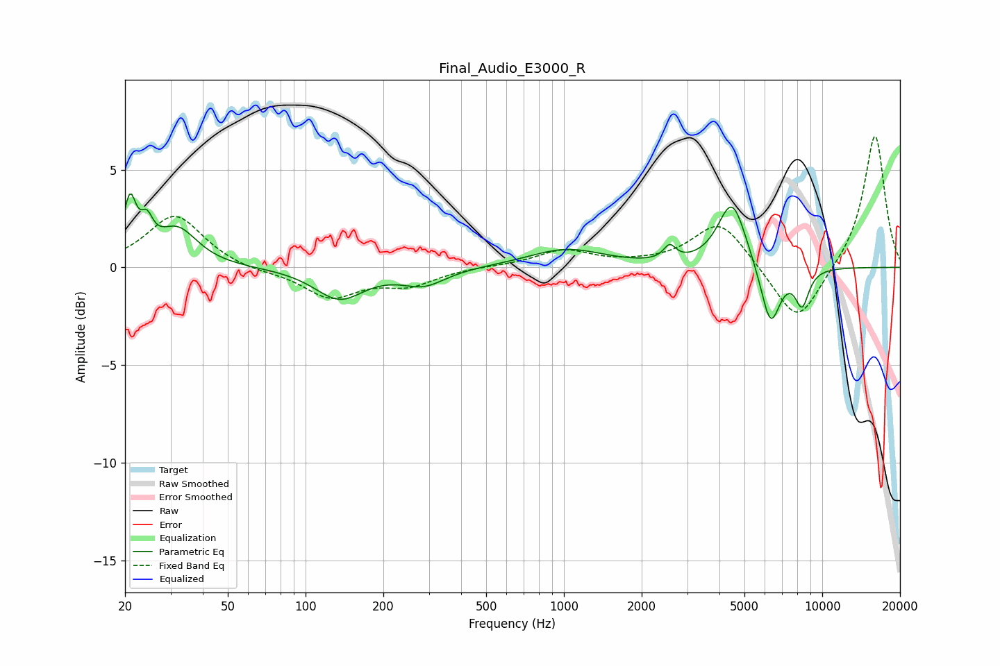

# Final_Audio_E3000_R
See [usage instructions](https://github.com/jaakkopasanen/AutoEq#usage) for more options and info.

### Parametric EQs
Apply preamp of -3.8 dB when using parametric equalizer.

|   # | Type    |   Fc (Hz) |    Q |   Gain (dB) |
|-----|---------|-----------|------|-------------|
|   1 | Peaking |        21 | 5.93 |         2.9 |
|   2 | Peaking |        24 | 6    |         1.3 |
|   3 | Peaking |        32 | 1.84 |         1.9 |
|   4 | Peaking |       135 | 1.49 |        -1.6 |
|   5 | Peaking |       287 | 1.67 |        -0.8 |
|   6 | Peaking |      1021 | 0.97 |         0.9 |
|   7 | Peaking |      2568 | 6    |         0.7 |
|   8 | Peaking |      4476 | 2.56 |         3.4 |
|   9 | Peaking |      6303 | 3.56 |        -3.2 |
|  10 | Peaking |      8355 | 4.86 |        -1.8 |

### Fixed Band EQs
When using fixed band (also called graphic) equalizer, apply preamp of **-6.8 dB** (if available) and set gains manually with these parameters.

|   # | Type    |   Fc (Hz) |    Q |   Gain (dB) |
|-----|---------|-----------|------|-------------|
|   1 | Peaking |        31 | 1.41 |         2.7 |
|   2 | Peaking |        62 | 1.41 |        -0.2 |
|   3 | Peaking |       125 | 1.41 |        -1.5 |
|   4 | Peaking |       250 | 1.41 |        -0.8 |
|   5 | Peaking |       500 | 1.41 |         0.1 |
|   6 | Peaking |      1000 | 1.41 |         0.9 |
|   7 | Peaking |      2000 | 1.41 |         0.1 |
|   8 | Peaking |      4000 | 1.41 |         2.4 |
|   9 | Peaking |      8000 | 1.41 |        -3   |
|  10 | Peaking |     16000 | 1.41 |         6.9 |

### Graphs

