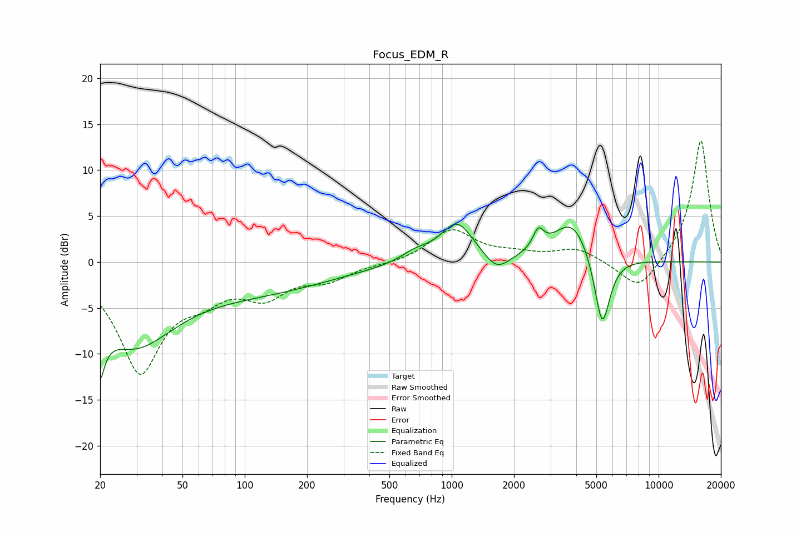

# Focus_EDM_R
See [usage instructions](https://github.com/jaakkopasanen/AutoEq#usage) for more options and info.

### Parametric EQs
Apply preamp of -4.2 dB when using parametric equalizer.

|   # | Type    |   Fc (Hz) |    Q |   Gain (dB) |
|-----|---------|-----------|------|-------------|
|   1 | Peaking |        20 | 5.47 |        -9.1 |
|   2 | Peaking |        20 | 5.95 |         3.3 |
|   3 | Peaking |        29 | 0.69 |        -8.3 |
|   4 | Peaking |       125 | 0.41 |        -2.7 |
|   5 | Peaking |       666 | 2.01 |         1   |
|   6 | Peaking |      1060 | 1.77 |         4.3 |
|   7 | Peaking |      1649 | 2.38 |        -1.9 |
|   8 | Peaking |      2624 | 5.38 |         2.1 |
|   9 | Peaking |      3819 | 1.53 |         4.6 |
|  10 | Peaking |      5338 | 3.63 |        -8.3 |

### Fixed Band EQs
When using fixed band (also called graphic) equalizer, apply preamp of **-13.3 dB** (if available) and set gains manually with these parameters.

|   # | Type    |   Fc (Hz) |    Q |   Gain (dB) |
|-----|---------|-----------|------|-------------|
|   1 | Peaking |        31 | 1.41 |       -11.6 |
|   2 | Peaking |        62 | 1.41 |        -2.5 |
|   3 | Peaking |       125 | 1.41 |        -3.2 |
|   4 | Peaking |       250 | 1.41 |        -1.7 |
|   5 | Peaking |       500 | 1.41 |        -0.2 |
|   6 | Peaking |      1000 | 1.41 |         3.5 |
|   7 | Peaking |      2000 | 1.41 |         0.7 |
|   8 | Peaking |      4000 | 1.41 |         1.4 |
|   9 | Peaking |      8000 | 1.41 |        -3.3 |
|  10 | Peaking |     16000 | 1.41 |        13.4 |

### Graphs

