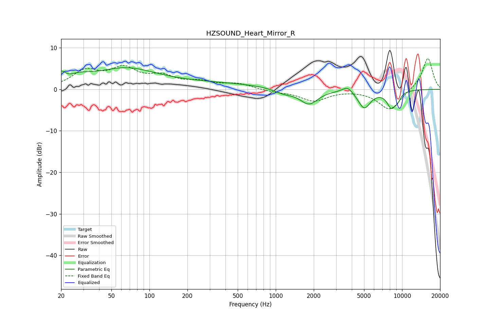

# HZSOUND_Heart_Mirror_R
See [usage instructions](https://github.com/jaakkopasanen/AutoEq#usage) for more options and info.

### Parametric EQs
Apply preamp of -5.3 dB when using parametric equalizer.

|   # | Type    |   Fc (Hz) |    Q |   Gain (dB) |
|-----|---------|-----------|------|-------------|
|   1 | Peaking |        21 | 1.14 |         5.1 |
|   2 | Peaking |        23 | 2.49 |        -2.5 |
|   3 | Peaking |        65 | 0.63 |         3.9 |
|   4 | Peaking |       234 | 0.25 |         1.5 |
|   5 | Peaking |      1161 | 1.8  |        -1.1 |
|   6 | Peaking |      1833 | 1.99 |        -3.5 |
|   7 | Peaking |      3703 | 3.49 |         1.5 |
|   8 | Peaking |      5021 | 2.8  |        -4.4 |
|   9 | Peaking |      8218 | 3.6  |        -3.8 |
|  10 | Peaking |      9202 | 4.87 |        -1.5 |

### Fixed Band EQs
When using fixed band (also called graphic) equalizer, apply preamp of **-7.5 dB** (if available) and set gains manually with these parameters.

|   # | Type    |   Fc (Hz) |    Q |   Gain (dB) |
|-----|---------|-----------|------|-------------|
|   1 | Peaking |        31 | 1.41 |         4.1 |
|   2 | Peaking |        62 | 1.41 |         4.5 |
|   3 | Peaking |       125 | 1.41 |         2.6 |
|   4 | Peaking |       250 | 1.41 |         1.5 |
|   5 | Peaking |       500 | 1.41 |         1.2 |
|   6 | Peaking |      1000 | 1.41 |        -0.5 |
|   7 | Peaking |      2000 | 1.41 |        -2.7 |
|   8 | Peaking |      4000 | 1.41 |         0   |
|   9 | Peaking |      8000 | 1.41 |        -5   |
|  10 | Peaking |     16000 | 1.41 |         7.7 |

### Graphs

